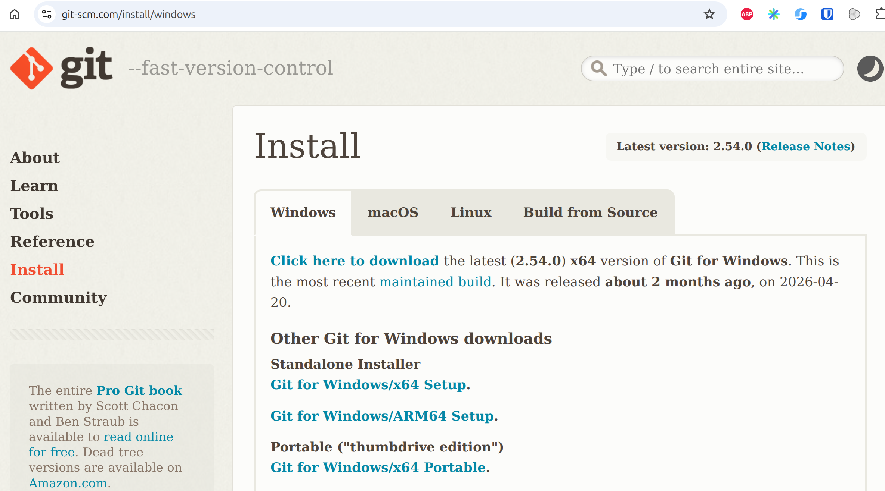
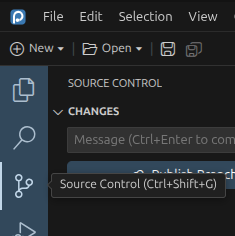
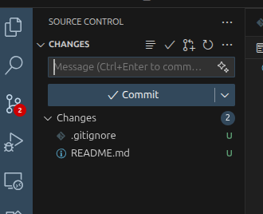
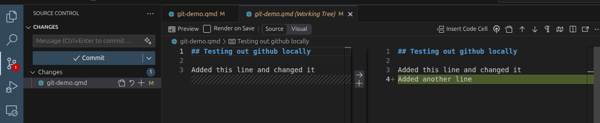
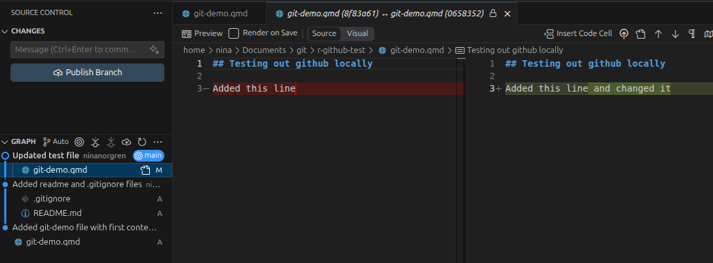
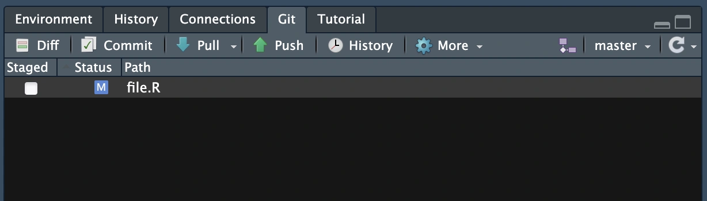
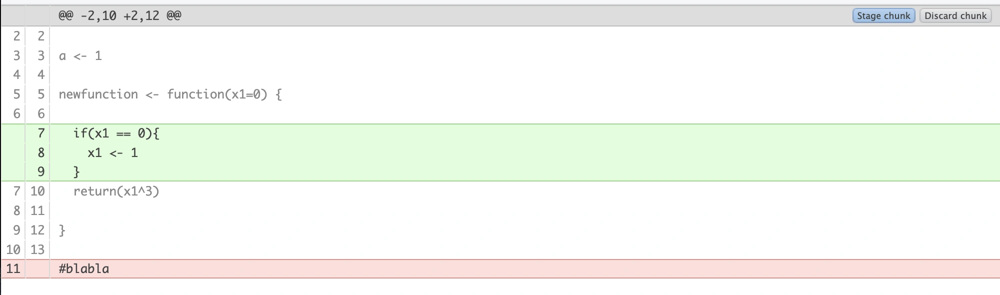
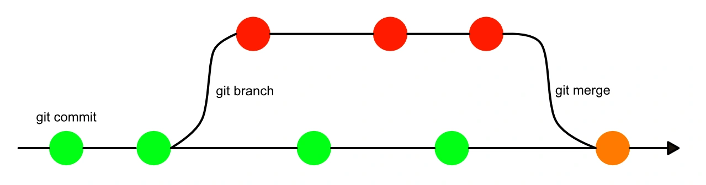

## Install git

If you don't have git installed on your computer, go here and follow the installation instructions:





## Configure git

Before your first commit, git needs to know who you are. It stamps every commit
with a name and email — this is *not* a login, just the author label baked into
the commit. Set it once, globally:

```bash
git config --global user.name "Your Name"
git config --global user.email "you@example.org"
```

If you prefer to do it the R way, there's of course a package for this: `usethis` 

```{r eval=F}
usethis::use_git_config(
  user.name  = "Your Name",
  user.email = "you@example.org"
)
```


::: {.callout-tip}
Use the same email you use (or will use) on GitHub — it's how GitHub links your
commits to your account later.
:::

If you want, you can also update your default branch name. Git uses `master` as default name, while GitHub has switched to `main`,

```bash
git config --global init.defaultBranch main
```

Check what you've set at any time with:

```bash
git config --list
```

There are different ways to use git locally on your computer. Below we will introduce two ways, the command line or through Positron. Try either or both. You can also mix using them. Alls settings you have configured are global, and are applied regardless if you interact with git through the commandline or through Positron.


# The basics - Command line

## Initiate an empty git repository

```bash
git init
```

You can see that git has added a hidden folder called .git in the root folder where you initiated the git repository. To check on the status of the repository, you can run:

```bash
git status
```

As we have no files in this folder yet, git will just tell you something like this:

```no-highlight
On branch main

No commits yet

nothing to commit (create/copy files and use "git add" to track)
```

::: {.callout-tip}
If you try to run `git status` in a non-Git directory, it will say
that it is _not a git repository_. Git looks for the hidden directory 
`.git/` where all information is stored. This hidden directory contains
all information and settings Git needs in order to run and version
track your files. This also means that your Git-tracked directory
is self-contained, _i.e._ you can simply delete it and everything that
has to do with Git in connection to that directory will be gone.
:::

## Create a file

Create a file with some random content, either in an editor or just using the command line:

```bash
echo "Content to my file" > random.txt
```

Once you have done that, run `git status` again. It will tell you that there
are files in the directory that are not version tracked by Git.

## Add and commit changes

We will now commit the untracked files. A commit is essentially a set of
changes to a set of files. Preferably, the changes making out a commit should
be related to something, _e.g._ a specific bug fix or a new feature.

- Our first commit will be to add the copied files to the repository. Run the
  following (as suggested by `git status`):

```bash
git add random.txt
```

- Run `git status` again! See that we have added `random.txt` to our upcoming
  commit (listed under "_Changes to be committed_"). This is called the _staging
  area_, and the files there are staged to be committed.

- We are now ready to commit! Run the following:

```bash
git commit -m "Add random file"
```

The `-m` option adds a commit message. This should be a short description of
what the commit contains. If you omit the -m flag it will open a text editor 
where you can write the message in.

- Run `git status` again. It should tell you _"nothing to commit, working
  directory clean"_.


## Change a file

Let's repeat this process by editing a file!

- Open up `random.txt` in your favourite editor and add a bit more text to the file.

- Run `git status`. It will tell you that there are modifications in one file
  (`random.txt`) compared to the previous commit. This is nice! We don't have to
  keep track of which files we have edited, Git will do that for us.

- Run `git diff random.txt`. This will show you the changes made to the file. A
  `-` means a deleted line, a `+` means an added line. A few lines before and
  after the changes are also shown for context.

- Now let's add and commit the changes to this file.

You can track all changes made to files that are version controlled using `git log`:

```bash
git log
```

::: {.callout-note title="Quick recap"}
These are the `git` commands we have used this far:

- `git init` tells Git to track the current directory.
- `git status` is a command you should use _a lot_. It will tell you,
  amongst other things, what files are changed, if they are staged or commit.
- `git add <file>` adds a file to the staging area.
- `git commit` commits the file to git.
- `git diff <file>` shows the difference between the commited file and unstaged file.
- `git log` show a log of all commit details.
:::

# The basics - Positron

## Start a new project in Positron

Click on Initialize Git repository.
Creates a hidden .git folder in your project and a README.md file.

## Create a file

Add a new file to the folder and write something in it.

## Add and commit changes

Now you want to first add your changes to the staging area. Do this by going to the Source Control tab in on the left hand side in Positron. There you will see a list of all files with or without changes. The small U to the right of the file means the changes have not been staged.

:::: {.columns}

::: {.column width="50%"}

:::

::: {.column width="50%"}

:::

::::

Click on the small plus next to the file to stage the file. Do this with all the files you want to later commit. Once it's staged it will be marked with a small A. Now you can add a short but informative commit message, and commit your changes. They are now saved in git.


## Change a file

Try adding a few more files and change some existing ones. If you change a file you can click on the file in the source control tab, and see the difference to the file that is already committed, and the new changes.



Stage and commit the changes. Now, let's look at the history. In Positron you can look at the git graph and see all changes made to files at certain commits:



All those files are now version controlled!


# Keeping order

So far we've only added things. Now let's practise taking them back.

## Unstage a file (but keep the edit)

- Open `random.txt`, add a line, and stage it:

```bash
git add random.txt
```

- Run `git status` and confirm it's listed under "_Changes to be committed_".

- Now unstage it:

```bash
git restore --staged random.txt
```

- **Predict before you run:** is your new line gone, or just unstaged? Run
  `git status` to check.

The line is still there, the file is simply back to "modified but not staged".
`git restore --staged` restored the *staging area* from the last commit; it
never touched your working file.

::: {.callout-tip title="In Positron"}
Hover the staged file in the Source Control panel and click the `−` (minus) to
unstage it — same as `git restore --staged`. Your edit stays put.
:::

## Discard an unstaged change (this one bites)

- With that edit still unstaged, discard it:

```bash
git restore random.txt
```

- Run `git status`, then open the file.

This time the edit is **gone**. The bare `git restore` restored the *working
file* from the staging area and there was nothing staged, so it reverted to
the last commit.

::: {.callout-important}
Same command, two trees. `git restore --staged <file>` rewinds the **staging
area** (your edit survives in the file). `git restore <file>` rewinds the
**working file** (your edit is discarded). The flag decides which one you're
undoing. There's no undo for the second one, the change wasn't committed, so
git has nothing to bring back.
:::

::: {.callout-tip title="In Positron"}
Hover the file and click the **Discard Changes** (revert) icon to throw the
edit away, same as `git restore`. Positron asks you to confirm, because, as on
the command line, there's no getting it back.
:::


# Telling git what to ignore

Some files should never be tracked: editor junk, rendered output, large data,
secrets, etc. Git keeps a full copy of every version of every tracked file, so
ignoring the right things keeps your history clean and your repo small.

## Create some junk, then ignore it

- Make a couple of files you would never want in version control:

```bash
echo "old session" > .Rhistory
echo "rendered" > report.html
```

- Run `git status`. Git wants to track both.

- Create a file called `.gitignore` in the repository if you don't already have it, with these contents:

```no-highlight
# R session junk
.Rhistory
.RData
.Rproj.user/

# Rendered output
*.html
```

- Run `git status` again.

The junk has vanished from the list. Git now ignores anything matching those
patterns. (Note: you *do* want to commit `.gitignore` itself, it's part of the
project.)


# Working on parallel lines: branches

A branch lets you work on something without disturbing your main line of work.
The mental model that makes everything else click: **a branch is just a movable
pointer to a commit.** Making a commit moves the current pointer forward one
step. That's why branching is instant, git writes a tiny pointer, it doesn't
copy your files.

## See where you are now

- Draw the current history:

```bash
git log --oneline --graph --all
```

Using the `--onelin` flag compresses the commit history to just one line for readability.
Note the labels — `main` and `HEAD` are both pointing at your latest commit.
`HEAD` means "the branch I'm currently on".

## Make a branch and commit on it

- Create a branch and move onto it in one step:

```bash
git switch -c experiment
```

- Run `git status` (it tells you which branch you're on) and `git branch` (the
  `*` marks the current one).

- Make a change to `random.txt` and commit it.

- Draw the graph again:

```bash
git log --oneline --graph --all
```

**Watch what moved:** `experiment` advanced to the new commit, `main` stayed
put. You just saw the pointer move.

## Switch back and merge

- Go back to `main`:

```bash
git switch main
```

- Open `random.txt`. Your `experiment` change isn't here, `main` never moved.

- Merge the branch in:

```bash
git merge experiment
```

- Draw the graph once more.

Because `main` hadn't moved on its own, git just slid its pointer forward to
catch up with `experiment`. This is a **fast-forward** merge, no new commit
needed.

::: {.callout-tip title="In Positron"}
The current branch name sits in the status bar (bottom of the window). Click it
to create or switch branches. The Git Graph view shows the same picture as
`git log --graph`. Everything in this block works through those, but doing it
on the command line first makes it obvious what the buttons are doing.
:::


# When git can't decide: merge conflicts

A conflict isn't an error. It's git refusing to *guess* when two branches changed
the same lines. You, not git, decide which version wins. This is the single
most useful thing to have done once in a safe sandbox before it happens for real.

## Set up two conflicting edits

- Make sure you're on `main` and that `random.txt` has a known first line.
  Commit if needed so you have a clean starting point.

- Create a branch, change the first line one way, and commit:

```bash
git switch -c feature
# edit random.txt - change the first line to, say, "Hello from feature"
git add random.txt
git commit -m "Change greeting on feature"
```

- Switch back to `main` and change the *same line* differently:

```bash
git switch main
# edit random.txt - change the same first line to "Hello from main"
git add random.txt
git commit -m "Change greeting on main"
```

Both branches now have a different version of the same line.

## Trigger and resolve the conflict

- Merge:

```bash
git merge feature
```

Git stops and tells you there's a conflict. Run `git status`, it lists the file
under "_Unmerged paths_" and, helpfully, tells you what to do next.

- Open `random.txt`. Git has written both versions in, marked like this:

```no-highlight
<<<<<<< HEAD
Hello from main
=======
Hello from feature
>>>>>>> feature
```

- Edit the file by hand: keep the version you want (or combine them), and
  **delete all three marker lines** (`<<<<<<<`, `=======`, `>>>>>>>`). If you use Positron it will remove them for you.

- Tell git you've resolved it, and complete the merge:

```bash
git add random.txt
git commit
```

- Draw the graph:

```bash
git log --oneline --graph --all
```

This time merging the two diverged lines of work produced a real **merge
commit**, you can see the two branches joining back together.


# Additional reading and exercises

Want more? There's tons of git resources out there. Below are a few of them with topics that might come in handy:

[How to undo things](https://git-scm.com/book/en/v2/Git-Basics-Undoing-Things)  
[Tagging your work](https://git-scm.com/book/en/v2/Git-Basics-Tagging)  
[Deep dive into branching](https://git-scm.com/book/en/v2/Git-Branching-Branches-in-a-Nutshell)  


# Sharing your work: remotes and GitHub

Everything so far has been local. A **remote** is a copy of your repo somewhere
else — usually GitHub — so you can back it up, share it, and collaborate. This is
the payoff for working reproducibly *and together*.

## Connect your repo to GitHub

- On GitHub, create a new **empty** repository (no README, no `.gitignore` — we
  want it empty so it doesn't immediately diverge from yours). Copy its URL.

- Back in your local repo, connect it. The conventional name for your main
  remote is `origin`:

```bash
git remote add origin <url-you-copied>
git remote -v        # check it's registered
```

- Push your commits up, setting `origin/main` as the default for next time:

```bash
git push -u origin main
```

- Refresh the GitHub page — your files and full history are now there.

## Pull changes down

- On GitHub, edit a file directly in the browser and commit it there. Now your
  remote is one commit ahead of your local copy.

- Bring that commit down:

```bash
git pull
```

`git pull` is really `git fetch` (download) + `git merge` (combine) — which
means a pull can produce a merge conflict exactly like the one you just resolved.

::: {.callout-important title="Authentication"}
GitHub stopped accepting passwords for git in 2021, so your first push will ask
for credentials. Two options:

- **HTTPS + Personal Access Token (PAT)** — easiest to start with.
- **SSH keys** — set up once, nothing to paste afterwards.

R users have a gentle path for all of this — see the next section.
:::

## Clone someone else's repo

- Pick any public repo and copy it, history and all, to your machine:

```bash
git clone <url>
```

Cloning sets up `origin` for you automatically — no `git remote add` needed.

::: {.callout-tip title="In Positron"}
"Clone Repository" from the welcome screen or command palette does the same as
`git clone`. After that, the **Sync** button in the Source Control panel pushes
and pulls for you.
:::


# Stretch: collaborate in pairs

Only attempt this if you're comfortable with everything above — it combines
remotes *and* conflicts, which is two hard things at once.

- Pair up. One person creates a GitHub repo and adds the other as a collaborator
  (repo Settings → Collaborators).

- **Both** clone it.

- Person A edits a file, commits, and pushes. Person B runs `git pull` and sees
  A's change appear.

- Now swap roles.

- For the full experience: have **both** people edit the *same line*, both
  commit. The first to push succeeds; the second person's `push` is rejected
  ("remote contains work you do not have locally"). They run `git pull`, resolve
  the conflict locally — just like before — then push the merge. This is the
  everyday reality of collaborating with git.


# git the R way: usethis

Now that you know what each step does underneath, here's how to do the whole
setup from the R console. The `usethis` package wraps the same git operations
you've been running by hand.

```r
install.packages("usethis")

usethis::use_git()        # init a repo + make the first commit
usethis::use_github()     # create a GitHub repo and connect + push to it
usethis::use_git_ignore(  # add entries to .gitignore
  c(".Rhistory", ".RData", ".Rproj.user")
)
```

When something with GitHub authentication goes wrong — and at some point it
will — these two are your friends:

```r
usethis::create_github_token()  # walks you through making a PAT
usethis::git_sitrep()           # "situation report": diagnoses your setup
```

::: {.callout-note title="Where to go next"}
- **Happy Git with R** — <https://happygitwithr.com> (Jenny Bryan). The
  definitive R + git + GitHub guide; start here for any setup pain.
- **<https://dangitgit.com>** — plain-English fixes for "oh no" moments.
- `git <command> --help` — the built-in manual for any command.

You won't remember every command today, and you don't need to. Remember the
**model** — working tree → staging area → commit → remote — and look the rest
up.
:::

<!--
Lab outline

Main lab:
From RStudio, create a new R project with git version control.
Connect to github.
Create some R file.
Insert some code.
Commit.
Push.
Go to repository on github.
Introduce some changes.
pull to local.
Insert some more code.
Check out the diff.
reset to previous commit.

Create a repository on github.
Clone that repository into Rstudio.

End of main lab:
Delete created repositories on github.


Lab extras:
Branches
Merge conflicts
Forks
pull requests
github actions
-->

::: {.callout-note}
This is the lab on using git and GitHub with R. It will take you through some basic steps to start using git with your R code and how to work with others on the same code. When you are comfortable there are some more exercises showing good to know functionalities of git and GitHub.

This lab assumes that you have a GitHub account, commandline git and correct git configurations. If you do not and need help, please contact a TA.
:::

## Install packages

The first thing we want to do is install the package required for the exercise.

```{r}
#| eval: false
install.packages("usethis")

```

## Working with git and GitHub starting from RStudio
Let's go through the common situation of starting a new project and connecting it to git and GitHub. Let's create a mental model for this: Hypothetically, you have just been asked to perform some data analysis, produce some plots, and now it is time to start!

1. In RStudio, create a new project in a new directory. You can initialize it as a git repository upon creation or you can do that after using `usethis::use_git()`.

2. Connect it to GitHub using `usethis::use_github()`.

3. Create an R script in your project and write some code. You are free to do whatever you want here. Write a function, create a plot, use a public dataset. Go crazy!

4. Use the RStudio *git pane* to `commit` your code including a commit message.



5. `push` the changes to your GitHub repository. Then go to GitHub and check that you can see your changes there. In your mental model, this is you sharing your code with your collaborators or users.

6. Now introduce some changes to your script from GitHub and `commit` them. At this point, your GitHub repository is one `commit` ahead of your local repository. In the mental model, this can be your collaborators making changes in their local repository and `push`ing it to your shared GitHub project, or a user suggesting a change, that you accept, in your publicly available R-package, used by millions. For now, lets ignore thinking about who has access to `commit` to your repository, but do not worry, there are ways to safeguard this. Your code can be open on GitHub without other people being able to ruin it so you have to constantly go back to a previous unruined `commit`!

7. To transfer the changes in the GitHub repository to your local repository, go back to RStudio and use the blue arrow in the *git pane* to `pull` the changes. In the mental model this is you updating your code with the code contributed by your collaborators. Notice here that if if you had in the meantime made some changes to the local repository in the same R script and position as you had on GitHub, there would be what is called a "merge conflict" when you tried to `pull`. We will get to those later.

8. Let's look at the `diff` operation. Make some changes in your local repository R script again, both removing and adding something, then press the `diff` button in the *git pane*. This should bring up a new window that is similar to the image below. As you can see it clearly shows you what has been added and what has been removed, what the `diff`erence is since your last `commit`.



9. Go ahead and `commit` the changes you made. No need to `push` them to GitHub. Now lets go into our mental model and say that you did not like those changes. You have done something you regret, or broken something, and you want to go back. One of the main points of version control after all is the ability to go back. To `revert` to the last commit state you can use the *Revert..* button in RStudios *git pane*, it is in a dropdown from the cogwheel. Go ahead and test it!  
If you want to go further back to an older commit you will have to use the *terminal pane* in RStudio. In essence, you are using git from the terminal in your local repository. Here are the commands:

```{bash}
#| eval: false

git reset HEAD~1
git restore <our R script>
```

`git reset HEAD~n` steps you back in your `commit` history `n` `commit`s. In this case `HEAD~1` means *go one `commit` back*. Look at your R script, are the changes you made still there? They should be. You have gone back one `commit`, not removed the changes you made during that `commit`. But now that we are on this `commit` you can `git restore` your R script file to take it back to the way it was at the start of current `commit`. Go ahead and try it out and make sure it works as you would expect it to!

---
Now you should have all the tools you need to work with git in a basic capacity, starting from a new project on your device. Notice that you do not need to start from a new project, you can also take a folder with lots of work you have already performed and make it an R project and initialize git in it. It will of course only track changes from that point, not what you have done previously, but it is still a good idea!

The point here being that starting from scratch or starting from a bunch of work that you have already done, or starting by creating a GitHub repository and pulling that into RStudio using *File > New Project > Version Control > Git* , there are tools for any situation and it is not too late to start working reproducibly, collaboratively and with backups using git!

## Additional topics and exercises

### Branches

Branches in git are a way to create a separate version controlled instance of your repository. Think of your git changes as a tree trunk, growing as you `add` and `commit`, but always possible to `reset` and go back down to a lower point on the trunk.  Then `branch`ing is the equivalent of a `branch` shooting out at a certain point on that trunk with the possibility to grow as you develop that `branch`. This permits you or someone else to work on a separate idea at the same time as you continue to develop the trunk. Say for example that you have a situation where there is a stable release of your R package and you do not want to `push` changes to this. So you create a `branch` called "development" and when you are happy with it you merge that `branch` back into the trunk!



Useful commands for branches from terminal:

- `git branch <name of branch>` : Create a new branch.
- `git branch` : See list of branches. Current branch marked with *.
- `git checkout <name of branch>` : Move to branch.
- `git merge <name of branch>` : Merge the branch you are currently on with the branch named in command.

However, you can work with branches from RStudio as well! To do this you can use the purpleish button in *git pane* that looks like two squares connected with a diamond. Once you have created a new branch you can switch branches to the right of the branch button in the *git pane*.

Exercise:

1. Either create a new git version controlled R project in Rstudio, or continue from your last one.
2. Create a new branch using RStudio. Make sure you are on that branch afterwards.
3. Introduce some changes in your R script. `commit` them. In our mental model, this is you developing something experimental until you are satisfied with it.
4. Switch back to the main branch.
5. To `merge` the new branch with our main branch we will use the terminal again. In the RStudio terminal perform the `merge`. In the mental model this you being satisfied with the development branch and calling it a stable release, a part of the main body of code!

Congratulations, you now know how to create a branch, switch between branches, and merge the branch back into main. 

### Merge conflicts

Earlier we thought about the issue of changes being introduces in the same file and position in your local copy of a repository and in the GitHub version of the repository at the same time. A so called "merge conflict". This can also happen if you are working on two branches, introduce changes in the same places, and then try to merge! But you should try not to worry too much about merge conflicts, they can be solved if you know what you are doing.

1. Introduce changes in the same part of your code on your main and new branch. `commit` the changes.

2.  Use `git merge <name of branch>` from the main branch. This should result in the merge conflict.

The output you should get from the `merge` is similar to:

```{bash}
#| eval: false

Auto-merging file.R
CONFLICT (content): Merge conflict in file.R
Automatic merge failed; fix conflicts and then commit the result.
```

You can also use `git status` from terminal to check which file is modified and why.

Once a merge conflict occurs the file affected is modified to reflect the conflicting areas. It can look something like this:

```{bash}
#| eval: FALSE

#Hello world!"

<<<<<<< HEAD
a <- 2

b <- 2
=======
a <- 3
>>>>>>> test
```

In this instance it is telling us that in branch named "test" `a <- 3`but on our main branch `a <- 2` and `b <- 2` has also been added. To pick which one you want to go with simply delete the `>>,<<,==` notifiers and whichever rows of code that you do not want.
Once you have done this, finalize the merge by `commit`ing the changed files.

3. Fix your merge conflict and finalize the merge.

Good job! You know know how to resolve merge conflicts!

### Forks and pull requests

Forking a repository on GitHub means creating a copy of the repository on your GitHub user. This can be very useful if you want to make some changes to a repository that you do not have `push` access to, for example. It is also a great way collaborate because it adds more backups of the repository and because of "pull requests", which are a way of implementing your local changes to the source repository where the owner of the repository has the power to review and choose whether to accept them or not.

For example, in this RaukR course we have a repository for all the teaching materials that all teachers have forked, made changes to and then submitted a pull request back to the source repository.

To fork a repository you can either use the GitHub website of the repository you want to fork, or you can use `usethis`. If you are using RStudio it will also automatically create a R project for the local repository.

```{r}
#| eval: false

usethis::create_from_github(
  "https://github.com/<user name of owner>/<repository name>",
  destdir = "~/path/to/place/repo/",
  fork = TRUE
)
```

This command does a lot of things, from [happygitwithr](https://happygitwithr.com/fork-and-clone.html)

> - Forks the source repo on GitHub.
> - Clones your fork to a new local repo (and RStudio Project). This configures your fork as the origin remote.
> - Configures the source repo as the upstream remote.
> - Sets the upstream tracking branch for main (or whatever the default branch is) to upstream/main.
> - Opens a new RStudio instance in the new local repo (and RStudio Project).

We have not covered "upstream" and "remote" in our git vocabulary yet. Basically remotes are connections for your repository, and being upstream means being a repository closer to the source than your repository, which is downstream (as it is a fork). So the sentence "Configures the source repo as the upstream remote" translates to adding a connection specifying that the source repository is where your repository came from. This connection is used to update your fork with any future changes that occur in the source repository.

1. Fork the repository [https://github.com/Sebastian-D/testgit](https://github.com/Sebastian-D/testgit) using one of the methods described. Also clone a local copy of it. Make sure you can find your fork on GitHub.

Now we are ready to make some changes to the code in our local repository. But before this we should create a new branch for the pull request. For this we can use `usethis::pr_init(branch = "branchName")`. This will also automatically switch to the branch.

2. Create a branch then make some changes to the repository. In the mental model you are implementing some feature or fixing some bug.

3. `add` and `commit` the changes with a commit message.

To submit a pull request you can use `pr_push()`. This should open a browser where you can submit the pull request. If the maintainer of the source repository wants to modify the pull request he can either do this himself or suggest some changes to you, whereupon you make the changes the run `pr_push()` again.

4. Submit the `pull` request! Go ahead and view it on GitHub.

There is a whole family of pr-* functions for both the person submitting the pull the request and the maintainer of the source repository that will review and accept/decline the pull request. I really recommend you read [here](https://usethis.r-lib.org/articles/pr-functions.html) if you think this is of interest!

Good job completing the exercises! git and GitHub are big topics, but knowing a little gets you a long way and then you discover the rest when you need it!

## Session

<details>
  <summary>Click here</summary>

```{r}
#| label: session

sessionInfo()
```

</details>

