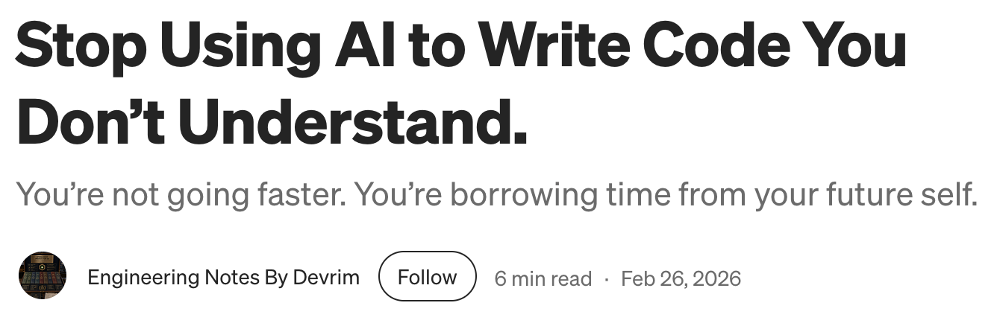
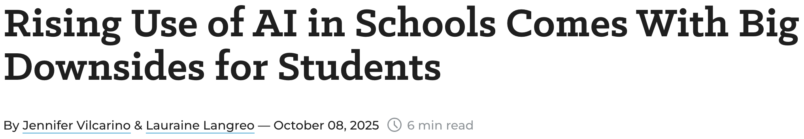
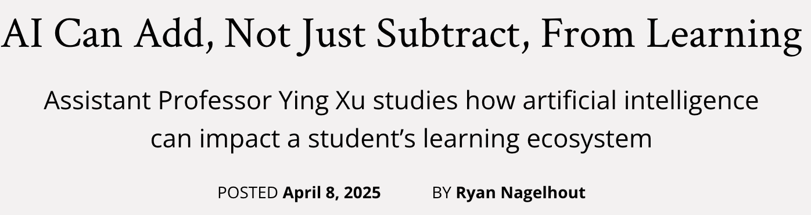
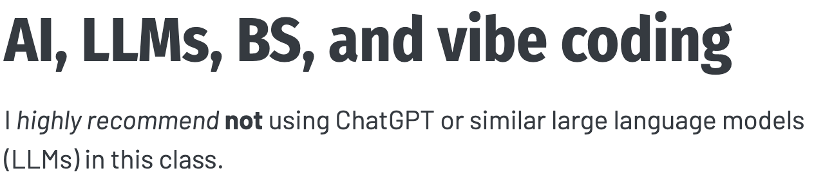
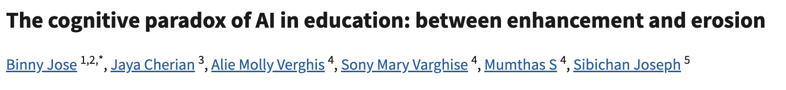
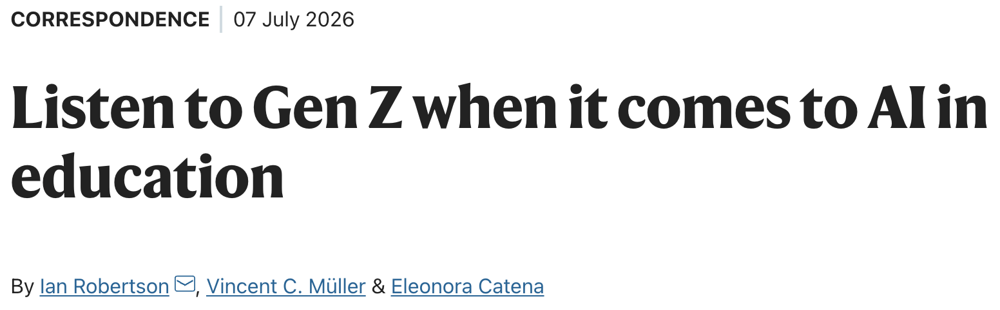
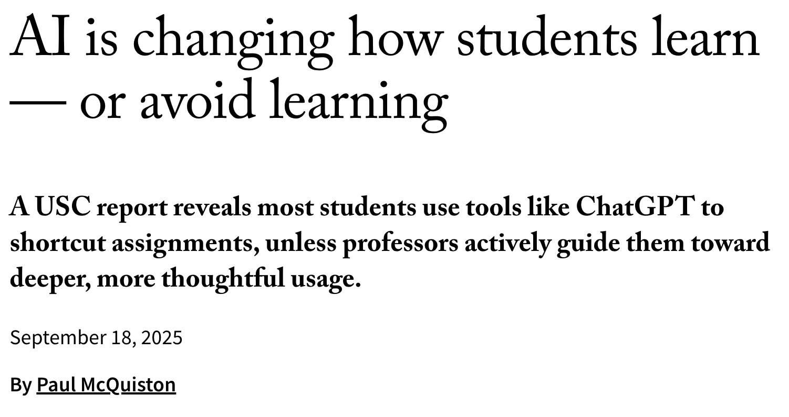
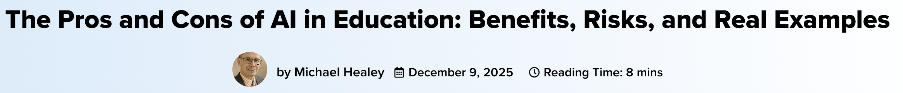
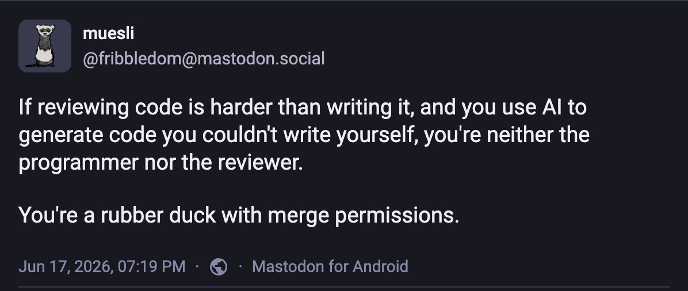

##  {visibility="hidden"}

```{r}
#| echo: false
# pak::pak("hadley/emo")
library(emo)
```

## Learning Outcomes

<br>

After this module:

- You will think more about when you should use AI.

. . .

- You will be aware of different coding styles.

. . .

- You will know what styles are good and bad and why.

. . .

- You will think a bit about what is a good name.

. . .

- You will learn about code formatting.

. . .

- You will sample some different notations.

. . .

- You will think about when it is appropriate to use AI.

## When to use AI

Here we discuss that studies show that AI is not good for learning so you should only use it to ask for explanations, not to complete assignments during course.

## What is Coding Style?

:::: {.columns}
::: {.column width="50%"}
- Naming conventions --- assigning names to variables

- Code formatting --- placement of braces, use of white space characters etc.
:::

::: {.column width="50%"}

 2010-09-23. By Oliver Widder, Webcomics Geek And Poke.]{.smaller}](assets/coding_style.webp){.left height="600px"}
:::
::::

## Naming Conventions

A syntactically valid name:

- Consists of:
  - letters: `r paste0(paste0(letters, collapse=''), paste0(LETTERS, collapse=''))`
  - digits: `r paste(0:9, collapse='')`
  - period: `.`
  - underscore: `_`

- Begins with a letter or the period (`.`), if `.` should **not** followed by a number

- Cannot be one of the *reserved words*: `if`, `else`, `repeat`, `while`, `function`, `for`, `in`, `next`, `break`, `TRUE`, `FALSE`, `NULL`, `Inf`, `NaN`, `NA`, `NA_integer_`, `NA_real_`, `NA_complex_`, `NA_character_`

- Also cannot be: `c`, `q`, `t`, `C`, `D`, `I` as they are reserved function names.

## Naming Style

Variable names that are legal are not necessarily a good style and they may be dangerous `r emo::ji('danger')`:

```{r logical_values}
F
T
```

```{r the_TF_trap}
F + T
```

```{r the_TF_trap_cted}
F <- 3
F + T
```

```{r reset_false}
#| include: false
T <- TRUE
F <- FALSE
```

do not do this!

. . .

unless you are a politician `r emo::ji('suit')`...

Avoid `T` and `F` as variable names.

## Customary Variable Names

:::: {.columns}
::: {.column}

Also, there is a number of variable names that are traditionally used to name particular variables:

- `usr` &mdash; user
- `pwd` &mdash; password
- `x`, `y`, `z` &mdash; vectors
- `w` &mdash; weights
- `f`, `g` &mdash; functions
- `n` &mdash; number of rows
- `p` &mdash; number of columns
- `i`, `j`, `k` &mdash; indexes
- `df` &mdash; data frame
- `cnt` &mdash; counter
- `M`, `N`, `W` &mdash; matrices
- `tmp` &mdash; temporary variables

:::

::: {.column}

Sometimes these are domain-specific:

- `p`, `q` &mdash; allele frequencies in genetics,
- `N`, `k` &mdash; number of trials and number of successes in stats

<br>
<br>
[Try to avoid using these for other variables to avoid possible confusion.]{.large}

:::
:::

## Code formatting

:::: {.columns}
::: {.column width="70%"}
**Goal: Improve readability**

<br>
1. Consistent indentation/whitespace

```{r indentation_bad}
#| eval: false
a <- 15
b <- 20

c <- function(a, b) {
  #Bad
  return(a + b)
}

d <- 1 + 2:3 * (4 / 5)
```

```{r indentation_good}
#| eval: false
a <- 15
b <- 20
c <- function(a, b) {
  #Good
c <- function(a, b) {
  #Good
  return(a + b)
}
d <- 1 + 2:3 * (4 / 5)
```

:::
::: {.column width="30%"}
{height="300px"}

:::
::::

## Code formatting

:::: {.columns}
::: {.column width="70%"}
**Goal: Improve readability**

<br>
2. Consistent braces and linewidth

```{r linewidth_bad}
#| eval: false
#| # Bad
fn <- function(a_really_long_variable_name, another_really_long_name) {
  a_really_long_variable_name + another_really_long_name
}
```

```{r linewidth_good}
#| eval: false
# Good
fn <- function(
  a_really_long_variable_name,
  another_really_long_name
) {
  a_really_long_variable_name + another_really_long_name
}
```

:::
::: {.column width="30%"}
{height="300px"}

:::
::::

## Code formatting

:::: {.columns}
::: {.column width="70%"}

Enable format on save:
```{r}
#| eval: false
"[r]": {
        "editor.formatOnSave": true
    }
```

:::
::: {.column width="30%"}
{height="300px"}

:::
::::

## Different Notations

People use different notation styles throughout their code:

. . .

- `snake_notation_looks_like_this`

. . .

- `camelNotationLooksLikeThis`

. . .

- `period.notation.looks.like.this`

. . .

But many also use...

. . .

- `LousyNotation_looks.likeThis`

. . .

Try to be consistent and stick to one of them. Bear in mind `period.notation` is used by S3 classes to create generic functions, e.g. `plot.my.object`. A good-enough reason to avoid it?

. . .

It is also important to maintain code readability by having your variable names:

- informative, e.g. `genotypes` vs. `fsjht45jkhsdf4`

. . .

- Not too long, e.g. `weight` vs. `phenotype.weight.measured`

## Special Variable Names

- There are built-in variable names:

  - `LETTERS`: the 26 upper-case letters of the Roman alphabet
  - `letters`: the 26 lower-case letters of the Roman alphabet
  - `month.abb`: the three-letter abbreviations for the English month names
  - `month.name`: the English names for the months of the year
  - `pi`: the ratio of the circumference of a circle to its diameter

- Variable names beginning with period are **hidden**: `.my_secret_variable` `r emo::ji('ghost')` will not be shown but can be accessed

```{r hidden_vars}
.the_hidden_answer <- 42
ls()
```

. . .

but with a bit of effort you can see them:

```{r show_hidden_vars}
ls(all.names = TRUE)
```

## When is AI appropriate?
{.absolute top="50%" left="50%" width="600"}

{.absolute top="75%" left="10%" width="600"}

{.absolute top="25%" left="58%" width="600"}

{.absolute top="20%" left="10%" width="600"}

{.fragment .absolute top="90%" left="55%" width="600"}

{.fragment .absolute top="50%" left="3%" width="600"}

{.fragment .absolute top="10%" left="30%" width="600"}

{.fragment .absolute top="90%" left="0%" width="600"}

{.fragment .absolute top="80%" left="55%" width="600"}

## When is AI appropriate?

{.centered}

::: {.notes}
Short:
- Depends on how you use it.
- Generating solutions to exercises: Increases volume of topics but decreases understanding.
- Asking for explanations: Increases understanding but not volume of topics.

The effect of large language models (LLMs) in education is debated: Previous research shows that LLMs can help as well as hurt learning. In two pre-registered and incentivized laboratory experiments, we find no effect of LLMs on overall learning outcomes. In exploratory analyses and a field study, we provide evidence that the effect of LLMs on learning outcomes depends on usage behavior. Students who substitute some of their learning activities with LLMs (e.g., by generating solutions to exercises) increase the volume of topics they can learn about but decrease their understanding of each topic. Students who complement their learning activities with LLMs (e.g., by asking for explanations) do not increase topic volume but do increase their understanding. We also observe that LLMs widen the gap between students with low and high prior knowledge. While LLMs show great potential to improve learning, their use must be tailored to the educational context and students' needs.
- AI Meets the Classroom: When Do Large Language Models Harm Learning?
  Matthias Lehmann, Philipp B. Cornelius, Fabian J. Sting
  https://doi.org/10.48550/arXiv.2409.09047
:::

## {background-image="/assets/images/network.svg"}

::: {.v-center .center}
::: {}

[Thank you!]{.largest}

[Questions?]{.larger}

[ • [SciLifeLab](https://www.scilifelab.se/) • [NBIS](https://nbis.se/) • [RaukR](https://nbisweden.github.io/raukr-2026)]{.smaller}

:::
:::
