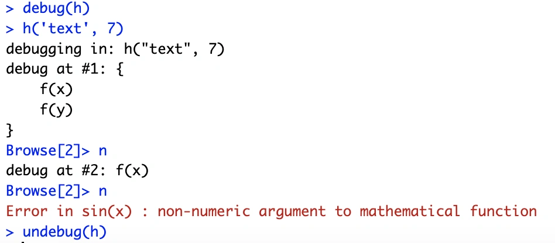
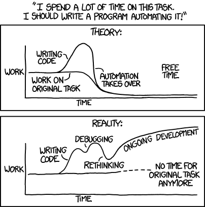
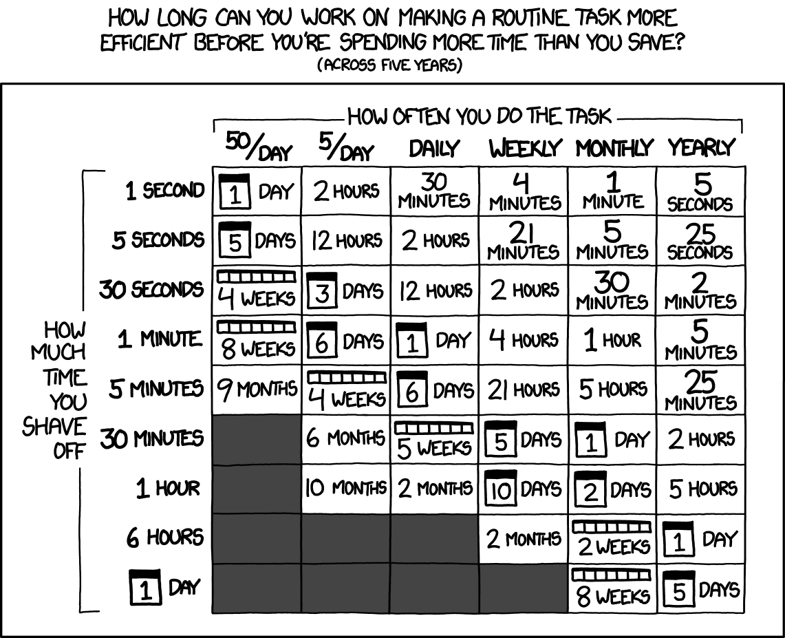
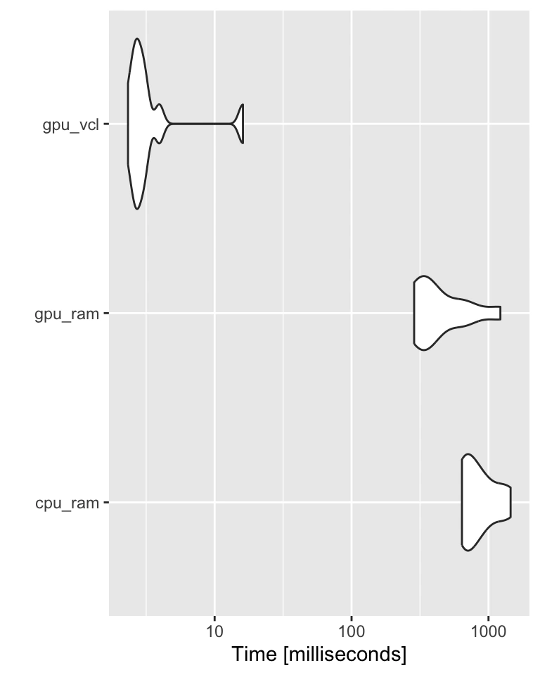

## {visibility="hidden"}

```{r}
library(tidyverse)
```

## What will we be talking about?

:::: {.columns}
::: {.column width="50%"}

<br><br><br>

::: {.incremental}

- *My code does not run!* -- **debugging**<br><br>
- *Now it does run but... out of memory!* -- **profiling**<br><br>
- *It runs! It says it will finish in 5 ~~minutes~~ years.* -- **optimization**

:::
:::
::: {.column width="50%"}


:::
::::

## Types of bugs {background-image="assets/featured.webp"}

- `r emo::ji('input_symbols')` Syntax errors

```{r}
#| eval: false
#| echo: true
#| code-line-numbers: "1|2"
pritnt(var1) 
mean(sum(seq((x + 2) * (y - 9 * b)))
```

. . .

- `r emo::ji('input_numbers')` Arithmetic 

```{r} 
#| echo: true
y <- 7 / 0
```
*Not in R though! `y = Inf`*

. . .

- `r emo::ji('apple')``r emo::ji('orange')` Type 

```{r}
#| eval: false 
mean('a')
```

. . .

- `r emo::ji('puzzle')` Logic

Everything works and produces seemingly valid output that is WRONG!  
IMHO those are the hardest `r emo::ji('skull')` to debug!

## How to avoid bugs

<br><br><br>

::: {.incremental}

- Encapsulate your code in smaller units `r emo::ji('bento_box')` (functions), you can test, AI can easily evaluate etc.<br><br>
- Use classes (OOP module next week) and type checking `r emo::ji('ok')`.<br><br>
- Test `r emo::ji('test_tube')` at the boundaries, e.g. loops at min and max value.<br><br>
- Feed your functions with test data `r emo::ji('floppy_disk')` that should result with a known output.
:::

## Zoo of errors: the floating point trap

<br><br>

```{r floating_point_trap1}
#| results: false
#| code-line-numbers: "1|2-3"
(vec <- seq(0.1, 0.9, by=0.1))
vec == 0.7 
vec == 0.5
```

. . .

```{r floating_point_trap2}
#| echo: false
(vec <- seq(0.1, 0.9, by=0.1))
vec == 0.7 
vec == 0.5
```

. . .

<br>

```{r arithmetic_bugs2_1}
#| eval: false
(0.5 + 0.1) - 0.6
(0.7 + 0.1) - 0.8 
```

. . .

```{r arithmetic_bugs2_2}
#| echo: false
(0.5 + 0.1) - 0.6
(0.7 + 0.1) - 0.8 
```

<br/>

## How to avoid the trap
<br><br>

```{r floating_rounding}
round((0.7 + 0.1) , digits = 2) - 0.8
```

. . .

When comparing floating point numbers, instead of this: 

```{r float_comparisons}
#| echo: true
(vec <- seq(0.1, 0.9, by=0.1))
vec == 0.7
```

. . .

Write this: 

```{r float_comparisons_epsilon}
epsilon <- 0.001
abs(vec - 0.7) <= epsilon
```

## Floating point technicalities

```{r}
head(unlist(.Machine))
```

. . .

```{r}
head(unlist(.Platform))
```

## Handling Errors with `try()`

```{r error_log}
#| error: true
inputs <- list(10, -10, "ten", 42)
```

. . .

```{r error_no_try}
#| error: true
for (i in inputs) {
  print(paste0("log10 of ", i, " is ", log10(i)))
}
```

. . .

```{r error_try}
#| error: true
for (i in inputs) {
  try(
    print(paste0("log10 of ", i, " is ", log10(i)))
  )
}
```

## Handling Errors with `tryCatch`

```{r error_log_tryCatch1}
#| error: false
#| warning: false
for (i in inputs) {
  tryCatch(
    {
      result <- log10(i)
      print(paste0("log10 of ", i, " is ", result))
    },
    warning = function(w) {
      print(paste0("A warning occured: ", w$message))
    },
    error = function(e) {
      print(paste0("An error occured: ", e$message))
    }
  )
}
```


## Debugging -- errors and warnings

::: {.incremental}

- An error in your code will result in a call to the `stop()` function that:
  - breaks the execution of the program (loop, if-statement, etc.)
  - performs the action defined by the global parameter `error`.
- A warning just prints out the warning message (or reports it in another way)

:::

. . .

- Global parameter `error` defines what R should do when an error occurs.

```{r debug_options}
#| eval: false
options(error = )
```

. . .

- You can use `simpleError()` and `simpleWarning()` to generate errors and warnings in your code:

```{r simpleErr_simmpleWarn}
#| code-line-numbers: "4"
f <- function(x) {
  if (x < 0) {
    x <- abs(x)
    w <- simpleWarning("Value less than 0. Taking abs(x)")
    w
  }
}
```

## Debugging -- what are my options?

- Old-school debugging: a lot of `print` statements
  - print values of your variables at some checkpoints,
  - sometimes fine but often laborious,
  - need to remove/comment out manually after debugging.

. . .

- Dumping frames
  - on error, R state will be saved to a file,
  - file can be read into debugger,
  - values of all variables can be checked,
  - can debug on another machine, e.g. send dump to your colleague!
  
. . .

- Traceback
  - a list of the recent function calls with values of their parameters
  
. . .

- Step-by-step debugging
  - execute code line by line within the debugger

## Option 1: dumping frames

```{r dump_frames}
#| eval: false
#| code-line-numbers: "2|4-6"

f <- function(x) { sin(x) }
options(error = quote(dump.frames(dumpto = "assets/testdump", to.file = T)))
f('test')
options(error = NULL) # reset the behavior
load('assets/testdump.rda')
# debugger(testdump)
```

Hint: Last empty line brings you back to the environments menu.

## Option 2: traceback

```{r traceback}
#| eval: true
#| echo: true
#| error: true

f <- function(x) { 
  log10(x) 
}
g <- function(x) { 
  f(x) 
}
g('test')
```

. . .

```
> traceback()
2: f(x) at #2
1: g("test")
```

`traceback()` shows what were the function calls and what parameters were passed to them when the error occurred.

## Option 3: step-by-step debugging

:::: {.columns}
::: {.column width="50%"}

Let us define a new function `h(x, y)`:

```{r debug}
h <- function(x, y) { 
  f(x) 
  f(y) 
}
```

Now, we can use `debug()` to debug the function in a step-by-step manner:

```{r debug2}
#| eval: false
debug(h)
h('text', 7)
undebug(h)
```

:::

::: {.column .fragment width="50%"}



:::
::::

## Profiling -- `proc.time()`

Profiling is the process of **identifying memory** and time **bottlenecks** `r emo::ji('bottle')` in your code.

```{r proc_time}
proc.time()
```

- `user time` -- CPU time charged for the execution of user instructions of the calling process,
- `system time` -- CPU time charged for execution by the system on behalf of the calling process,
- `elapsed time` -- total CPU time elapsed for the currently running R process.

. . .

```{r proc_time_ex}
pt1 <- proc.time()
tmp <- runif(n =  10e5)
pt2 <- proc.time()
pt2 - pt1
```

## Profiling -- `system.time()`

```{r profiling_system_time}
system.time(runif(n = 10e6))
system.time(rnorm(n = 10e6))
```

. . .

An alternative approaches include `tic` and `toc` statements from the `tictoc` package.

```{r tictoc}
#| cache: true
tictoc::tic()
tmp1 <- runif(n = 10e6)
tictoc::toc()
```

## Profiling -- `bench::mark()`

or `mark()` from `bench` package:

```{r}
#| echo: true
#| eval: true
dat <- data.frame(
  x = runif(10000, 1, 1000),
  y = runif(10000, 1, 1000)
)
```

```{r bench}
bench::mark(
  dat[dat$x > 500, ],
  dat[which(dat$x > 500), ],
  subset(dat, x > 500)
)
```

## Profiling in action

These 4 functions fill a **large vector** with values supplied by function `f`.

. . .

1 -- loop without memory allocation.

```{r profiling_fundef1}
#| code-line-numbers: "2|3-5"
fun_fill_loop <- function(n = 10e6, f) {
  result <- NULL
  for (i in 1:n) {
    result <- c(result, eval(call(f, 1)))
  }
  return(result)
}
```

. . .

2 -- loop with memory allocation.

```{r profiling_fundef2}
#| code-line-numbers: "2|3-5"
fun_fill_loop_alloc <- function(n = 10e6, f) {
  result <- vector(length = n)
  for (i in 1:n) {
    result[i] <- eval(call(f, 1))
  }
  return(result)
}
```

## Profiling in action cted.

But it is maybe better to use...

. . .

vectorization!

. . .

3 -- vectorized loop without memory allocation.

```{r profiling_fundef3}
#| code-line-numbers: "2|3"
fun_fill_vec <- function(n = 10e6, f) {
  result <- NULL
  result <- eval(call(f, n))
  return(result)
}
```

. . .

4 -- vectorized with memory allocation.
```{r profiling_fundef4}
#| code-line-numbers: "2|3"
fun_fill_vec_alloc <- function(n = 10e6, f) {
  result <- vector(length = n)
  result <- eval(call(f, n))
  return(result)
}
```

## Profiling our functions
<br>

```{r profile_loop}
#| cache: true

benchmark <- microbenchmark::microbenchmark(
  fun_fill_vec_alloc(n = 1e4, "runif"),
  fun_fill_vec(n = 1e4, "runif"),
  fun_fill_loop_alloc(n = 1e4, "runif"),
  fun_fill_loop(n = 1e4, "runif"),
  times = 10L
)

ggplot2::autoplot(benchmark)
```

## Memory profiling

We can include the memory profiling, using, e.g. `Rprof()` function.

```{r Rprof}
#| include: true
#| eval: true
#| cache: false

Rprof('profiler_test.out', interval = 0.01, memory.profiling = T)
for (i in 1:5) {
  result <- fun_fill_loop_alloc(n = 1e4, "runif")
  print(head(result))
}
Rprof(NULL)
```

## Memory profiling cted.

```{r summaryRprof}
summary <- summaryRprof("profiler_test.out", memory = "both")
knitr::kable(summary$by.self)
unlink("profiler_test.out")
```

## Optimizing your code

::: {.blockquote}

We should forget about small efficiencies, say about 97% of the time: premature optimization is the root of all evil. Yet we should not pass up our opportunities in that critical 3%. A good programmer will not be deluded into complacency by such reasoning, he will be wise to look carefully at the critical code; but only after that code has been identified.

-- Donald Knuth

:::

:::: {.columns}
::: {.column width="50%"}

{height="350px"}  
[source: https://xkcd.com/1319]{.smaller}

:::

::: {.column width="50%"}

{height="350px"}  
[source: https://xkcd.com/1205/]{.smaller}

:::
::::

## Optimize your code

::: {.incremental}

- use DT `data.table` or `tibble` instead of `data.frame`
- avoid loops, use vectorization or `*apply` when possible
- allocate memory to avoid copy-on-modify,
- use `futures` or `mirai` for multicore/parallel execution
- use package `BLAS` for linear algebra,
- use `bigmemory` package,
- for large matrices consider GPU computations,

:::

## Copy-on-modify

```{r copy_on_modify}
order <- 1024
matrix_A <- matrix(rnorm(order^2), nrow = order)
matrix_B <- matrix_A
```

. . .

Check where the objects are in the memory:

. . .

```{r}
lobstr::obj_addr(matrix_A)
lobstr::obj_addr(matrix_B)
```

. . .

What happens if we modify a value in one of the matrices?

. . .

```{r}
matrix_B[1,1] <- 1
lobstr::obj_addr(matrix_A)
lobstr::obj_addr(matrix_B)
```

## Avoid copying by allocating memory

No memory allocation

```{r noalloc_ex}
#| code-line-numbers: "2|5"
f1 <- function(to = 3, silent=F) {
  tmp <- c()
  for (i in 1:to) {
    a1 <- lobstr::obj_addr(tmp)
    tmp <- c(tmp, i)
    a2 <- lobstr::obj_addr(tmp)
    if (!silent) { print(paste0(a1, " --> ", a2)) } 
  }
}
f1()
```

## Avoid copying by allocating memory cted.

With memory allocation

```{r alloc_ex}
#| code-line-numbers: "2|5"
f2 <- function(to = 3, silent = FALSE) {
  tmp <- vector(length = to, mode='numeric')
  for (i in 1:to) {
    a1 <- lobstr::obj_addr(tmp)
    tmp[i] <- i
    a2 <- lobstr::obj_addr(tmp)
    if(!silent) { print(paste0(a1, " --> ", a2)) }
  }
}
f2()
```

## Allocating memory -- benchmark.

```{r}
#| fig-align: center
#| fig-height: 4
#| fig-width: 10
#| cache: true

library(microbenchmark)
benchmrk <- microbenchmark(f1(to = 1e3, silent = T), 
                           f2(to = 1e3, silent = T), 
                           times = 100L)
ggplot2::autoplot(benchmrk)
```

## Function vectorization &mdash; the problem

```{r is_a_droid}
#| error: true
is_a_droid <- function(x) {
  droids <- c("2-1B", "4-LOM", "8D8", "0-0-0", "AP-5", "AZI-3", "Mister Bones", "BB-8", "BB-9E", "BD-1", "BT-1", "C1-10P", "C-3PO", "R2-D2")
  if (x %in% droids) {
    return(T)
  } else {
    return(F)
  }
}

test <- c("Anakin", "Vader", "R2-D2", "AZI-3", "Luke")
is_a_droid(test)
```

## Function vectorization &mdash; possible solution(s)

The `base::Vectorize` way:

```{r vec_is_a_droid}
vectorized_is_a_droid <- base::Vectorize(is_a_droid, vectorize.args = c("x"))
vectorized_is_a_droid(test)
```

. . .

`vapply` way:

```{r}
vapply(test, is_a_droid, FUN.VALUE = TRUE) # value type-safe sapply
```

. . .

`purrr` way:

```{r}
purrr::map(test, is_a_droid) %>% unlist()
```

## GPU with `gpuR`

```{r gpu_R}
#| cache: true
#| eval: false

A = matrix(rnorm(1000^2), nrow=1000) # stored: RAM, computed: CPU
B = matrix(rnorm(1000^2), nrow=1000) 
gpuA = gpuMatrix(A, type = "float") # stored: RAM, computed: GPU
gpuB = gpuMatrix(B, type = "float")
vclA = vclMatrix(A, type = "float") # stored: GPU, computed: GPU
vclB = vclMatrix(B, type = "float")
bch <- microbenchmark(
  cpu_ram = A %*% B,
  gpu_ram = gpuA %*% gpuB,
  gpu_vcl = vclA %*% vclB, 
  times = 10L) 
```

[More on [Charles Determan's Blog](https://www.r-bloggers.com/r-gpu-programming-for-all-with-gpur/).]{.smaller}

## GPU cted.

```{r}
#| cache: true
#| eval: false
#| fig-align: center
#| fig-height: 5
#| fig-width: 4

ggplot2::autoplot(bch)
```



## Parallel execution using `future`
```{r}
future::plan('multisession')

benchmark <- microbenchmark::microbenchmark(
  future::future(fun_fill_loop(n = 1e4, "runif")),
  fun_fill_loop(n = 1e4, "runif"),
  times = 10L
)
ggplot2::autoplot(benchmark)
```

## {background-image="/assets/images/network.svg"}

::: {.v-center .center}
::: {}

[Thank you!]{.largest}

[Questions?]{.larger}

[ • [SciLifeLab](https://www.scilifelab.se/) • [NBIS](https://nbis.se/) • [RaukR](https://nbisweden.github.io/raukr-2026)]{.smaller}

:::
:::
