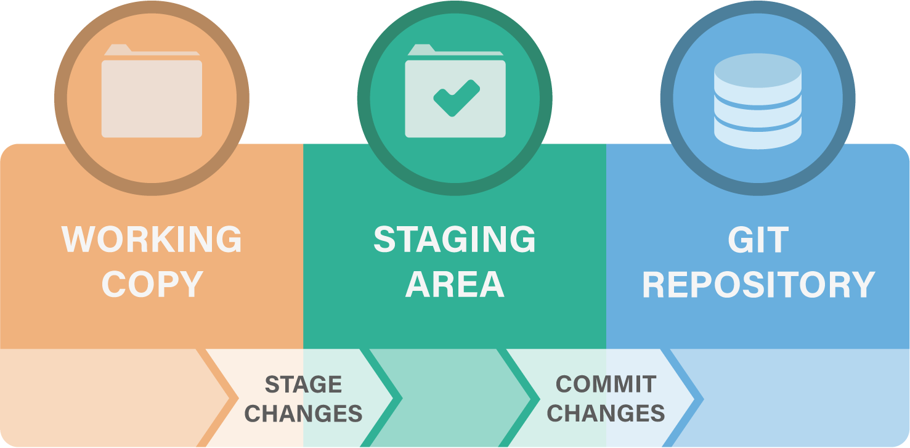
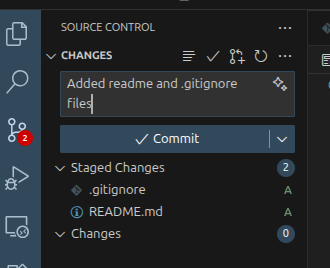
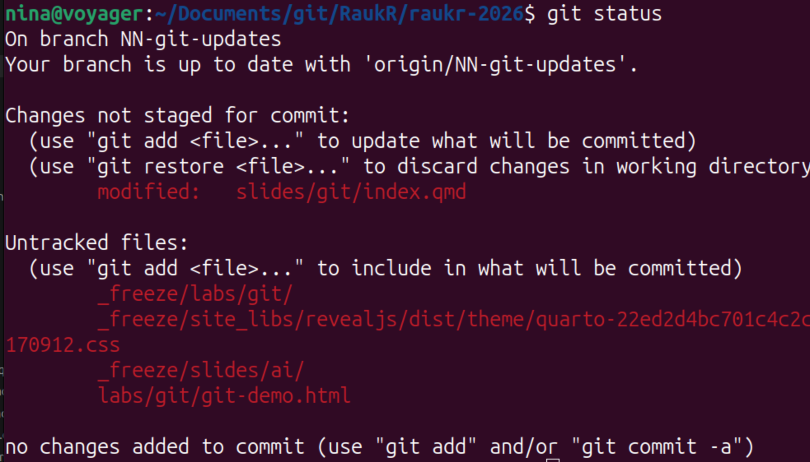
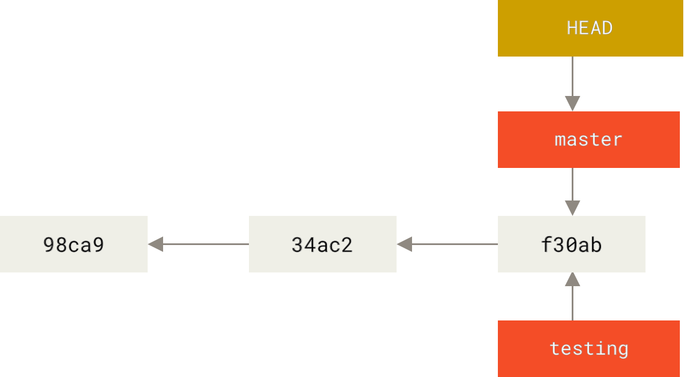
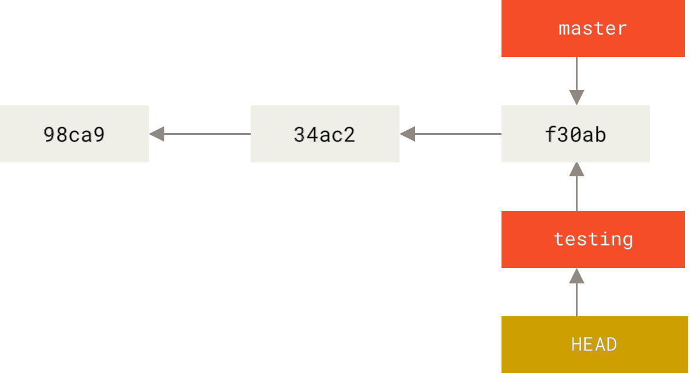
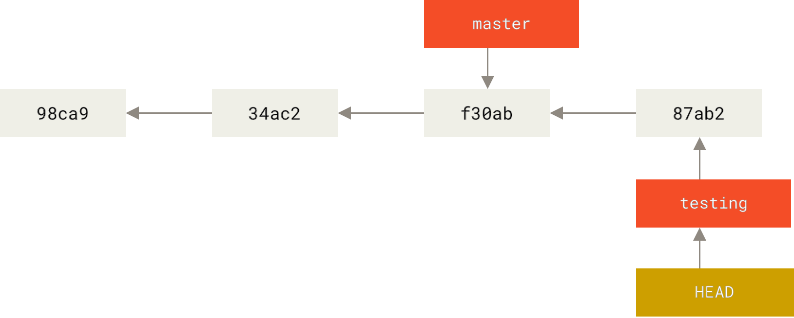
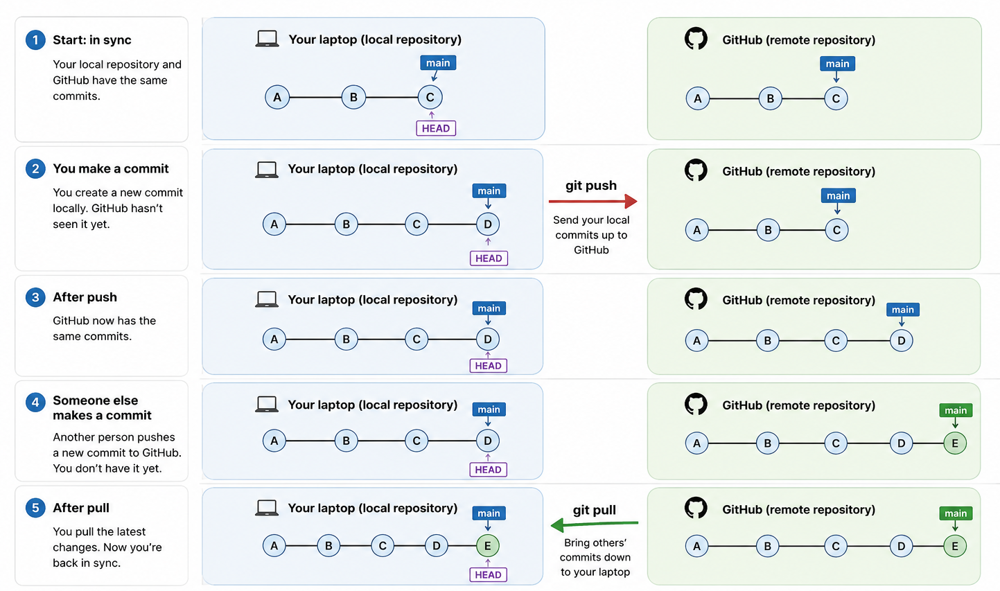
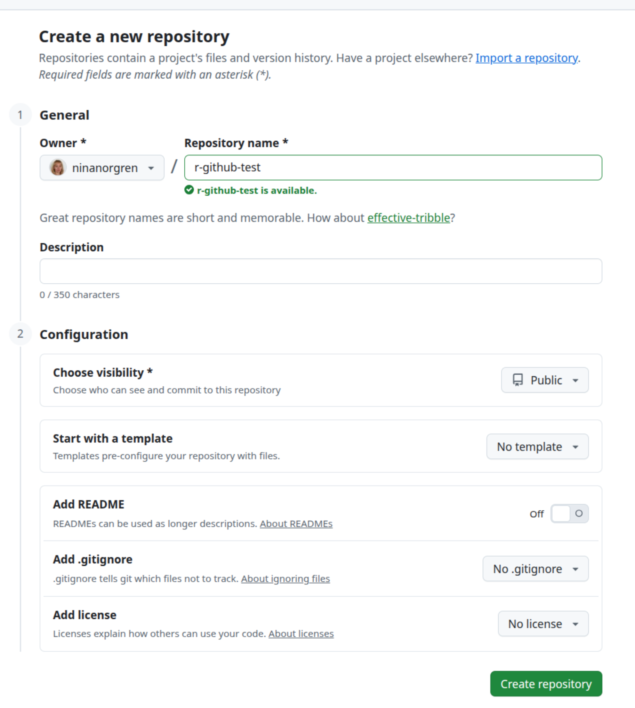
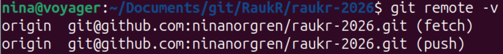

# What is this git? And how does it work?

## What is git?

<br>

:::{.incremental}

* A widely used system for distributed **version control**
* Keeps a **complete history** of the changes you make to your files
* Each point in the history can be re-visited and compared with others
* Git tracks **who contributed what** to your code
* Git can help you **version, backup and share** your code and documents
* Kind of like Dropbox, but you decide when each version is saved (plus a lot of more advanced features)
* Git is mainly used for **text files**, not large or binary files

:::

## Why should I use it?

<br>

"My code worked yesterday, now it's broken!"

<br>

:::{.fragment}
Revert to a previous version
:::


## Why should I use it?

<br>

"I forgot what and why I changed something in the code"

<br>

:::{.fragment}
Check the git history
:::

## Why should I use it?

<br>

"Several people have done changes to the same code, how do I solve this?"

<br>

:::{.fragment}
Let git try to merge it
:::


## What is the difference between git and GitHub?

<br>

:::: {.columns}

::: {.column width="60%"}
**Git:**

* Version control software
* Works locally on your computer


**GitHub:**

* Website for sharing Git repositories
* Collaboration platform
:::

::: {.column width="40%"}

{width=40%}

::: {.div style="margin-bottom:200px"}
:::


{width=60%}
:::

::::


# The basics


## Tracking code in three steps

<br>

{height=300 fig-align=center}

::: {.incremental}
1. Do some **coding** (*i.e.* make or change contents of files)
2. **Stage** the changes (*i.e.* specify which changes should be stored)
3. **Commit** the changes (storing them in the repository's history)
:::


## Interacting with git

<br>

:::: {.columns}

::: {.column width="50%"}
**From the command line**

```bash
git init
git add
git commit
git status 
```
:::

::: {.column width="50%"}

**Through Positron**



:::

::::

:::{.fragment}
::: {.callout-note}
Everything git knows lives inside `.git/`. Delete that folder and you have plain files again; the rest of your project is untouched.
:::
:::


# Knowing where you are

## Three commands you'll use constantly

<br>

:::{.incremental}

* `git status` - what's changed, and what's staged
* `git diff` - *line by line*, what exactly changed
* `git log` - the history of commits so far
:::

<br>

:::{.fragment}
When you're confused, run `git status`. It almost always tells you the next move.
:::

## Three commands you'll use constantly

<br>
{width=70%}


# Example



## What not to track through git

<br>

:::{.incremental}
* **Large or binary files** - git stores a full copy of every version, so the repo balloons (see Git LFS if you must)
* **Generated output** - anything you can re-create by re-running code
* **Secrets** - API keys, passwords, tokens. Git history is forever; a leaked key in an old commit is still leaked.
* **Data** - often too big, sometimes sensitive. Track the *code* that produces results, not the results.
* **Junk file** -  or rather files being produced by software and analysis, e.g. `.Rhistory`, `.RData`
:::


## .gitignore


<br>

List file patterns that should not be tracked in a file called `.gitignore`:

```
# R session junk
.Rhistory
.Rproj.user/

# Rendered output
*_files/

# Data and secrets — keep these out of git!
data/*.csv
```


:::{.fragment}
::: {.callout-important}
`.gitignore` only stops git from tracking files it isn't *already* tracking. Once committed, a file keeps being tracked until you explicitly remove it.
:::
:::

# Working on parallel lines: branches

## Why do we use branches?

<br>

::: {.incremental}
* Test out a new analysis
* Try a full re-write of something
* Two collaborators working on the same project
:::

<br>

::: {.fragment}

#### Workflow:

1. Create a branch from `main`
2. Do you changes and commit them
3. Once you are done, merge the branch back into `main`

:::

## What is a branch, really?

{width=100%}

A branch is **just a movable pointer to a commit** — a 41-byte file, nothing more.

<br>

:::{.incremental}
* Commits form a chain, each pointing back to its parent
* A *branch* is a label pointing at the latest commit on a line of work
* `HEAD` is a pointer to **the branch you're currently on**
:::

## What is a branch, really?

{width=100%}

<br>


* Changing branches moves HEAD to point to that branch

## What is a branch, really?

{width=100%}

<br>

* Making a commit moves the current branch pointer forward one step


## Create and switch to a new branch

<br>

```bash
git switch -c new-feature   # create a branch and move onto it
git switch main             # hop back to main
git branch                  # list branches; * marks the current one
```


## Merging

<br>

Bring the work from one branch into another:

```bash
git switch main
git merge new-feature
```

<br>

:::{.incremental}
* If `main` hasn't moved, git just slides its pointer forward, a **fast-forward**
* If both branches have new commits, git creates a **merge commit** merging the two histories together
:::

## When the same lines changed: conflicts

<br>

If two branches changed *the same lines*, git can't decide, it pauses and asks **you**:

```
<<<<<<< HEAD
result <- mean(x)
=======
result <- median(x)
>>>>>>> new-feature
```

<br>

:::{.fragment}
Edit the file to the version you want, delete the `<<<`/`===`/`>>>` markers, then:

```bash
git add <file>
git commit
```
:::


# Github

Local versus remote

## Why bother with GitHub?

<br>

git already works perfectly well on your own machine. So why put anything online?

<br>

:::{.incremental}
* **Backup**: your history lives somewhere other than your laptop. Laptop disasters won't erase 6 months of hard work
* **Sharing**: send a collaborator a link instead of zipping and emailing folders
* **Collaboration**: several people work on the same project without emailing versions back and forth
* **Reproducibility**: "code available at github.com/..." is now standard in papers; reviewers and readers can see exactly what you did
* **DOI**: You can get a citable DOI for a release (via Zenodo)
* **It's free**: public repositories cost nothing, and you get issue tracking, a project website, etc.
:::

## GitHub is just a remote copy

<br>

**GitHub doesn't do anything mysterious.** A GitHub repository is *just another git repository*, the same commits and history you have locally, hosted on a server you can reach over the internet.

<br>

:::: {.columns}

::: {.column width="50%"}
**On your laptop**

* A full repo in `.git/`
* Complete history
* Where you do your work
:::

::: {.column width="50%"}
**On GitHub**

* A full repo, identical history
* A copy you can reach from anywhere
* Where you share and back up
:::

::::

<br>

:::{.fragment}
::: {.callout-note}
The two are linked by a **remote**, a saved bookmark to the other copy, conventionally named `origin`. You keep them in sync by pushing commits up and pulling commits down.
:::
:::

## Two copies, kept in sync

<br>

Because both sides are real git repositories, syncing is just moving commits between them:

<br>

:::: {.columns}

::: {.column width="50%"}
**`git push`**

Send your local commits *up* to GitHub
:::

::: {.column width="50%"}
**`git pull`**

Bring others' commits *down* to your laptop
:::

::::

<br>

:::{.fragment}
This is the same pointer model as before, just across two machines: pushing moves GitHub's branch pointer forward to match yours; pulling moves yours forward to match GitHub's.

:::

## Syncing with Github

{width=100%}


## Nothing leaves your computer until you push

<br>

:::{.incremental}
* `git add` and `git commit` are **completely local** — they work on a plane with no wifi
* Your commits pile up in your local history, private to you
* Only `git push` sends them to GitHub
* Only then can anyone else see them
:::


## A typical day with both

<br>

git is for the work; GitHub is for sharing the work. A normal session uses both:

<br>

:::{.incremental}
1. **Once:** `git clone` a repo from GitHub (or push a new local one up)
2. **All day, offline:** edit → `git add` → `git commit`, over and over
3. **To share:** `git push` your commits up to GitHub
4. **To catch up:** `git pull` to bring in what collaborators pushed
:::

<br>

:::{.fragment}
Steps 2 are pure git, on your own machine. Steps 1, 3 and 4 are where GitHub comes in.
:::


## Create a GitHub repository

::: {.incremental}
* Create a GitHub account
* Create a new *empty* repository on GitHub

:::{.fragment}

{width=70%}
:::
:::

## Connect your local repo to GitHub

<br>

By convention, the main remote is called origin.

```bash
git remote add origin https://github.com/USERNAME/REPOSITORY.git
```

Check that it worked:

```bash
git remote -v
```

<br>

{width=100%}

## Authenticating with GitHub

<br>

GitHub no longer accepts your account password for Git operations over HTTPS.

<br> 

:::: {.columns}

::: {.column width="50%"}

**HTTPS
https://github.com/...**

Authenticate using a Personal Access Token

*Good default for beginners*
:::

::: {.column width="50%"}

**SSH
git@github.com:...**

Authenticate using a private key on your computer
The matching public key on GitHub

*Convenient after the initial setup*
:::

::::

:::{.fragment}
::: {.callout-note}
Your GitHub password is still used when signing in to the GitHub website. It just isn't used by git push over HTTPS.
:::
:::


# Git without the command line: Positron

## The same git, with buttons

<br>

Positron's **Source Control** panel calls the exact same git underneath. Every button maps to a command you already know:

<br>

:::: {.columns}

::: {.column width="55%"}
| In Positron | On the command line |
|---|---|
| `+` next to a file | `git add <file>` |
| Type message + **Commit** | `git commit -m "..."` |
| **Sync / Push** | `git push` / `git pull` |
| Branch name in status bar | `git switch` |
| Clicking a changed file | `git diff` |
:::

::: {.column width="45%"}
:::{.fragment}
The GUI is just a convenient front-end. Knowing the commands means you're never stuck when the buttons behave unexpectedly.
:::
:::

::::

# git the R way: usethis

## Let usethis do the setup

<br>

The `usethis` package automates the fiddly bits, all from the R console:

```r
usethis::use_git()          # init a repo + first commit
usethis::use_github()       # create a GitHub repo and connect it
usethis::use_git_ignore(    # add entries to .gitignore
  c(".Rhistory", ".RData")
)
usethis::git_sitrep()       # "situation report": diagnose your setup
```

<br>

:::{.fragment}
These wrap the same git operations — handy, but worth knowing what they do underneath.
:::

## Forks

<br>

Your own GitHub repository, but copied from someone else's.

When you don't have permission to push to the original repository

<br>

                 Original repository
                  (someone else's)
                        │
                     Fork
                        ▼
                  Your repository

<br>

:::{.incremental}

* A fork is a complete copy of another GitHub repository
* You own the fork and have full write access
* The original repository is unchanged
* You can clone your fork and work as usual
<br>

:::

## Pull requests

A Pull Request (PR) is a request to merge changes from one branch into another

<br>

  Your branch (or fork)
          │
          ▼
    Open Pull Request
          │
          ▼
  Review • Discuss • Test
          │
          ▼
        Merge

<br>

:::{.incremental}

* Compare your changes with the target branch
* Review the code before it is merged
* Merge once everyone is happy

:::

::: {.fragment}
A Pull Request doesn't change anything by itself, it just asks someone to review and merge your changes.
:::

## All terminology

<br>


**git**: local version control  
**Github**: hosting and collaboration platform for Git repositories  

**add**: stage a file for commit  
**commit**: commit the staged changes to the local repository  
**push**: send your local commits to the remote repository  
**pull**: bring commits from the remote repository to your local repository  

**Branch**: "copy" where you can test out new ideas  
**Fork**: your own copy of someone else's repository  
**Pull Request**: request to merge your changes into a branch  

## Where to go next

<br>

:::{.incremental}
* **Happy Git with R** — happygitwithr.com (Jenny Bryan). The definitive R + git + GitHub guide; start here for any setup pain.
* **dangitgit.com** — plain-English fixes for "oh no" moments
* `git <command> --help` — the built-in manual for any command
:::

<br>

:::{.fragment}
You won't remember every command today — and you don't need to. Remember the **model** (working tree → staging → commit → remote) and look the rest up.
:::