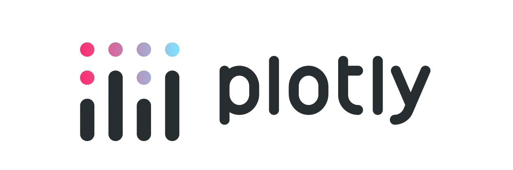

## Why Interactive Visualizations?

::: {.fragment}

- Explore a visualization through zooming, filtering, and hover details
- Communicate multi-dimensional data without showing every detail at once
- Allows users to explore the data themselves

:::
::: {.fragment}

**Design Principles**

- Start with a question, not a library
- Make every interaction earn its place
- Reveal detail on demand; do not overload the first view
- Shape, validate, and summarize data before it reaches the browser
- If interaction doesn't add value, stick with static plots
  - Keep a static fallback for reports, PDFs, and accessible summaries

:::

::: {.notes}

**Audience assumptions**

- Intermediate R users, comfortable with data frames, tidy workflows, `ggplot2`, and Quarto
- Shiny is covered separately

:::

## R interactive ecosystem

::: {.large .incremental}

- **Tables:** `DT`, `reactable`, `gt`
- **Charts:** `plotly`, `highcharter`, `dygraphs`, `ggiraph`, `echarts4r`, `r2d3` 
- **Maps:** `leaflet`, `mapgl`, `mapview`, `mapdeck`, `tmap`
- **Network**: `visNetwork`, `networkD3`, `DiagrammeR`
- **Other:** `crosstalk`, `heatmaply`, `dygraphs`

:::

## Tables • **DT**

:::: {.columns}
::: {.column width="45%"}

- DataTables.js
- Supports filtering, sorting, searching, pagination and export
- Handles large datasets well, but can be slow with many columns
- Extensions increase functionality
- Advanced features requires JavaScript knowledge

```r
library(DT)

datatable(
  iris[1:10, ], 
  options = list(
    pageLength = 5
  )
)
```

:::
::: {.column width="55%"}

```{r}
#| echo: false
#| eval: true
library(DT)
datatable(
  iris[1:10, ], options = list(pageLength = 5, scrollX = TRUE),
  rownames = FALSE, height = "330px"
)
```

:::
::::

::: {.aside}

[DT](https://rstudio.github.io/DT/)

:::

## Tables • **reactable**

:::: {.columns}
::: {.column width="45%"}

- Built on React.js, with a focus on R integration
- Supports filtering, sorting, searching, pagination and export
- Highly customizable with R and JavaScript
- Easy conditional formatting and custom cell rendering
- Supports expandable rows and grouped columns
- Integrates well with `reactR` and `bslib`

```r
library(reactable)

reactable(
  iris[1:10, ], 
  filterable = TRUE,
  defaultPageSize = 5
)
```

:::
::: {.column width="55%"}

```{r}
#| echo: false
#| eval: true
library(reactable)
reactable(
  iris[1:10, ], filterable = TRUE, searchable = TRUE,
  striped = TRUE, highlight = TRUE, defaultPageSize = 5, minRows = 5
)
```

:::
::::

::: {.aside}

[reactable](https://glin.github.io/reactable/)

:::

## Tables • **gt**

:::: {.columns}
::: {.column width="45%"}

- Primarily for static tables, but with some interactive support
- Most customizable option
- Best for publication-ready tables with complex formatting
- Not recommended for large datasets with many rows

```r
library(gt)
iris[1:6, ] |>
  gt() |>
  cols_label(
    Sepal.Length = "Sepal length"
  ) |>
  opt_interactive()
```

:::
::: {.column width="55%"}

```{r}
#| echo: false
#| eval: true
library(gt)

iris[1:6, ] |>
  gt() |>
  cols_label(
    Sepal.Length = "Sepal length", Sepal.Width = "Sepal width",
    Petal.Length = "Petal length", Petal.Width = "Petal width"
  ) |>
  opt_interactive()
```

:::
::::

::: {.aside}

[gt](https://gt.rstudio.com/)

:::

## **dygraphs**

:::: {.columns}
::: {.column width="45%"}

- Built for indexed time series
- Zoom and hover work immediately
- Good for sensor and monitoring data

```r
library(dygraphs)

dygraph(nhtemp) |>
  dyRangeSelector()
```

:::
::: {.column width="55%"}

```{r}
#| echo: false
#| eval: true
library(dygraphs)
dygraph(nhtemp, height = 500, width = 600) |>
  dyRangeSelector()
```

:::
::::

::: {.aside}

[dygraphs](https://rstudio.github.io/dygraphs/)

:::

## **leaflet**

:::: {.columns}
::: {.column width="60%"}

- Browser maps with markers, tiles, and layers
- Strong for exploratory geospatial interfaces
- Simplify geometries and check coordinate systems before plotting

```r
library(leaflet)

leaflet() |>
  addTiles() |>
  addMarkers(
    lng = 18.2885, 
    lat = 57.6393,
    popup = "<strong>Visby</strong>"
  )
```

- Alternatives: [`mapgl`](https://walker-data.com/mapgl/), [`mapview`](https://r-spatial.github.io/mapview/), [`mapdeck`](https://github.com/symbolixAU/mapdeck), [`tmap`](https://r-tmap.github.io/tmap/)

:::
::: {.column width="40%"}

```{r}
#| echo: false
#| eval: true
library(leaflet)
leaflet(height = 500, width = 600) |>
  addTiles() |>
  addMarkers(
    lng = 18.2885, lat = 57.6393,
    popup = "<strong>Visby</strong>"
  ) |>
  setView(lng = 18.2885, lat = 57.6393, zoom = 14)
```

:::
::::

## **visNetwork**

:::: {.columns}
::: {.column width="60%"}

- Interactive nodes and edges for relationship data
- Useful for dependency maps and lineage views
- Layout decisions determine whether a graph is readable

```r
library(visNetwork)

nodes <- data.frame(
    id = 1:3, 
    label = c("Raw", "Model", "Report")
)
edges <- data.frame(
    from = c(1, 2), 
    to = c(2, 3)
)
visNetwork::visNetwork(nodes, edges)
```

- Alternatives: [`networkD3`](https://christophergandrud.github.io/networkD3/), [`DiagrammeR`](https://rich-iannone.github.io/DiagrammeR/)

:::
::: {.column width="40%"}

```{r}
#| echo: false
#| eval: true
library(visNetwork)
nodes <- data.frame(id = 1:3, label = c("Raw", "Model", "Report"))
edges <- data.frame(from = c(1, 2), to = c(2, 3))

visNetwork(nodes, edges) |>
  visOptions(highlightNearest = TRUE, width = "500px", height = "500px")
```

:::
::::

## **ggiraph**

:::: {.columns}
::: {.column width="50%"}

- Adds hover and click behavior to `ggplot2`
- Keep the grammar you already know
- Ideal when a static plot needs useful tooltips

```r
library(ggplot2)
library(ggiraph)

p <- ggplot(iris, aes(
  Sepal.Length, 
  Sepal.Width, 
  colour = Species
)) + 
  ggiraph::geom_point_interactive(
  aes(tooltip = Species)
)
ggiraph::girafe(ggobj = p)
```

:::
::: {.column width="50%"}

```{r}
#| echo: false
#| eval: true
library(ggplot2)
library(ggiraph)

iris_plot <- ggplot(
  iris, aes(Sepal.Length, Sepal.Width, colour = Species)
) +
  ggiraph::geom_point_interactive(
    aes(tooltip = paste("Species:", Species)), size = 2
  ) +
  theme_minimal()
ggiraph::girafe(ggobj = iris_plot, width_svg = 6, height_svg = 4)
```

:::
::::

## Plotly

::: {.columns}
::: {.column width="70%"}

- An R interface to Plotly.js
- `plot_ly()` builds native Plotly traces and layouts
- `ggplotly()` converts a `ggplot2` object when speed matters more than exact control
- Choose traces, data, hover content, and layout deliberately

:::
::: {.column width="30%"}



:::
:::

::: {.aside}

[Reference](https://plotly.com/r/reference/index/)

:::

## Plotly: Scatterplot

:::: {.columns}
::: {.column width="50%"}

```r
library(plotly)
plot_ly(
  data = iris, 
  x = ~Sepal.Length, 
  y = ~Sepal.Width,
  color = ~Species, 
  type = "scatter", 
  mode = "markers"
)
```

:::
::: {.column width="50%"}

```{r}
#| echo: false
#| eval: true
library(plotly)

plot_ly(
  data = iris, 
  x = ~Sepal.Length, 
  y = ~Sepal.Width,
  color = ~Species, 
  type = "scatter", 
  mode = "markers",
  height = 500,
  width = 600
)
```

:::
::::

## Plotly: Hover and layout

:::: {.columns}
::: {.column width="50%"}

- Use `hoverinfo` to control tooltip content
- Use `text` to add custom hover content
- Use `layout()` for titles, axes, legends etc

```r
library(plotly)
plot_ly(
    iris, 
    x = ~Petal.Length, 
    y = ~Petal.Width,
    color = ~Species, 
    text = ~paste("Species:", Species),
    hoverinfo = "text",
    height = 500, width = 600
  ) |>
  layout(
    title = "Custom title", 
    legend = list(orientation = "h"),
    xaxis = list(title = "Petal length"), 
    yaxis = list(title = "Petal width")
  )
```

:::
::: {.column width="50%"}

```{r}
#| echo: false
#| eval: true
library(plotly)
plot_ly(
  iris, 
  x = ~Petal.Length, 
  y = ~Petal.Width, 
  color = ~Species,
  text = ~paste("Species:", Species),
  hoverinfo = "text",
  height = 500, 
  width = 600
) |>
  layout(
    title = "Custom title", 
    legend = list(orientation = "h"),
    xaxis = list(title = "Petal length"), 
    yaxis = list(title = "Petal width")
  )
```

:::
::::

## Plotly: The ggplot2 bridge

:::: {.columns}
::: {.column width="50%"}

- Make a `ggplot2` chart interactive with `ggplotly()`
- Converted legends and tooltips often need cleanup
- Use native `plot_ly()` when interaction is central to the design

```r
library(ggplot2)
library(plotly)

p <- ggplot(iris, aes(
  Sepal.Length, 
  Sepal.Width, 
  colour = Species
)) + 
  geom_point()

ggplotly(p)
```

:::
::: {.column width="50%"}

```{r}
#| echo: false
#| eval: true
library(ggplot2)
library(plotly)

ggplot_plot <- ggplot(
  iris, 
  aes(
    Sepal.Length, 
    Sepal.Width, 
    colour = Species
  )
) + geom_point() + 
  theme_minimal()

ggplotly(
  ggplot_plot, ,
  height = 500,
  width = 600
)
```

:::
::::

## Plotly: Linked subplots

:::: {.columns}
::: {.column width="50%"}

- Use a unique key to connect the same observations in two views.
- Brush items in one panel to highlight them in both.

```r
library(plotly)

iris_with_id <- transform(iris, id = seq_len(nrow(iris)))
linked_iris <- highlight_key(iris_with_id, ~id, group = "iris")

plot1 <- plot_ly(linked_iris, x = ~Sepal.Length, y = ~Sepal.Width,
  color = ~Species)
plot2 <- plot_ly(linked_iris, x = ~Petal.Length, y = ~Petal.Width,
  color = ~Species)
highlight(
  subplot(plot1, plot2, nrows = 2), 
  on = "plotly_selected"
)
```

:::
::: {.column width="50%"}

```{r}
#| echo: false
#| eval: true
library(plotly)
iris_with_id <- transform(iris, id = seq_len(nrow(iris)))
linked_iris <- highlight_key(iris_with_id, ~id, group = "iris")

plot1 <- plot_ly(
  linked_iris, x = ~Sepal.Length, y = ~Sepal.Width, color = ~Species
)
plot2 <- plot_ly(
  linked_iris, x = ~Petal.Length, y = ~Petal.Width, color = ~Species
)
highlight(
  subplot(plot1, plot2, nrows = 2),
  on = "plotly_selected"
) |>
  layout(height = 500, width = 600, showlegend = FALSE)
```

:::
::::

## Plotly: Grouped bars

:::: {.columns}
::: {.column width="55%"}

- Use `add_trace()` to add a series to an existing chart.
- Set `barmode = "group"` to compare categories side by side.

```r
library(plotly)
quarterly_orders <- data.frame(
  quarter = c("Q1", "Q2", "Q3", "Q4"),
  online = c(28, 42, 36, 52),
  retail = c(35, 31, 48, 44)
)
plot_ly(
  quarterly_orders,
  x = ~quarter,
  y = ~online,
  type = "bar",
  name = "Online"
) |>
  add_trace(
    y = ~retail,
    name = "Retail"
) |>
  layout(
    barmode = "group"
  )
```

:::
::: {.column width="45%"}

```{r}
#| echo: false
#| eval: true
library(plotly)

quarterly_orders <- data.frame(
  quarter = c("Q1", "Q2", "Q3", "Q4"),
  online = c(28, 42, 36, 52),
  retail = c(35, 31, 48, 44)
)

plot_ly(
  quarterly_orders,
  x = ~quarter,
  y = ~online,
  type = "bar",
  name = "Online",
  height = 500,
  width = 600
) |>
  add_trace(
    y = ~retail,
    name = "Retail",
    hovertemplate = "%{x}<br>%{fullData.name}: %{y}<extra></extra>"
  ) |>
  layout(
    barmode = "group",
    yaxis = list(title = "Orders")
  )
```

:::
::::

## Plotly: 3D scatterplots

:::: {.columns}
::: {.column width="50%"}

- Use a 3D trace only when the third axis answers a real question.

```r
library(plotly)

plot_ly(
  iris,
  x = ~Sepal.Length,
  y = ~Sepal.Width,
  z = ~Petal.Length,
  color = ~Species,
  type = "scatter3d",
  mode = "markers"
)
```

:::
::: {.column width="50%"}

```{r}
#| echo: false
#| eval: true
library(plotly)

plot_ly(
  iris,
  x = ~Sepal.Length,
  y = ~Sepal.Width,
  z = ~Petal.Length,
  color = ~Species,
  type = "scatter3d",
  mode = "markers",
  marker = list(size = 4),
  height = 500,
  width = 600
) |>
  layout(
    scene = list(
      xaxis = list(title = "Sepal length"),
      yaxis = list(title = "Sepal width"),
      zaxis = list(title = "Petal length")
    )
  )
```

:::
::::

## Highcharter

::: {.columns}
::: {.column width="70%"}

- An R wrapper around the [Highcharts](https://www.highcharts.com/) JavaScript ecosystem
- Start with `hchart()` for common data shapes
- Use `highchart()` plus `hc_add_series()` for explicit series control
- Configure chart, axes, tooltips, legend, and theme in small layers

:::
::: {.column width="30%"}


:::
:::

::: {.aside}

- [Highcharter reference](https://jkunst.com/highcharter/reference/index.html)
- [Highcharts JS API](https://api.highcharts.com/highcharts/)

:::

## Highcharter: Quick `hchart()`

:::: {.columns}
::: {.column width="45%"}

```r
library(highcharter)

iris |>
  hchart(
    "scatter",
    hcaes(
      x = Sepal.Length, 
      y = Sepal.Width, 
      group = Species
    )
  )
```

:::
::: {.column width="55%"}

```{r}
#| echo: false
#| eval: true
library(highcharter)
iris |>
  hchart(
    "scatter",
    hcaes(
      x = Sepal.Length, 
      y = Sepal.Width, 
      group = Species
    )
  ) |>
  hc_size(height = 500, width=500)
```

:::
::::

::: {.aside}

- [Highcharter reference](https://jkunst.com/highcharter/reference/index.html)
- [Highcharts JS API](https://api.highcharts.com/highcharts/)

:::

## Highcharter: Explicit series

:::: {.columns}
::: {.column width="50%"}

- Shape data in R, then add the result as a series.
- This pattern is useful when series need different options.

```r
library(highcharter)
quarterly_orders <- data.frame(
  quarter = c("Q1", "Q2", "Q3", "Q4"),
  Online = c(28, 42, 36, 52),
  Retail = c(35, 31, 48, 44)
)
highchart() |>
  hc_add_series(
    data = quarterly_orders$Online, type = "column",
    name = "Online"
  ) |>
  hc_add_series(
    data = quarterly_orders$Retail, type = "column",
    name = "Retail"
  ) |>
  hc_xAxis(categories = quarterly_orders$quarter) 
```

:::
::: {.column width="50%"}

```{r}
#| echo: false
#| eval: true
library(highcharter)
quarterly_orders <- data.frame(
  quarter = c("Q1", "Q2", "Q3", "Q4"),
  Online = c(28, 42, 36, 52),
  Retail = c(35, 31, 48, 44)
)
highchart() |>
  hc_add_series(
    data = quarterly_orders$Online, type = "column", name = "Online"
  ) |>
  hc_add_series(
    data = quarterly_orders$Retail, type = "column", name = "Retail"
  ) |>
  hc_xAxis(categories = quarterly_orders$quarter) |>
  hc_yAxis(title = list(text = "Orders")) |>
  hc_size(height = 500, width = 500)
```

:::
::::

## Highcharter: Axes, tooltips, legend

:::: {.columns}
::: {.column width="50%"}

- Chart options layer cleanly after data and series.
- Use labels and tooltips to make values interpretable.

```r
library(highcharter)
highchart() |>
  hc_add_series(
    data = c(5, 8, 6, 9), type = "line"
  ) |>
  hc_xAxis(
    categories = c("Q1", "Q2", "Q3", "Q4")
  ) |>
  hc_yAxis(title = list(text = "Value")) |>
  hc_tooltip(
    pointFormat = "Value: <b>{point.y}</b>"
  ) |>
  hc_legend(
    layout = "horizontal", 
    align = "center"
  ) |>
  hc_size(height = 500, width = 500)
```

:::
::: {.column width="50%"}

```{r}
#| echo: false
#| eval: true
library(highcharter)
highchart() |>
  hc_add_series(data = c(5, 8, 6, 9), type = "line", name = "Value") |>
  hc_xAxis(categories = c("Q1", "Q2", "Q3", "Q4")) |>
  hc_yAxis(title = list(text = "Value")) |>
  hc_tooltip(pointFormat = "Value: <b>{point.y}</b>") |>
  hc_legend(layout = "horizontal", align = "center") |>
  hc_size(height = 500, width = 500)
```

:::
::::

## Highcharter: Time range and export

:::: {.columns}
::: {.column width="50%"}

- Stock charts add a navigator for choosing a time window.
- A range selector provides quick jumps to common intervals.
- Export controls let readers take away the current view.

```r
library(highcharter)

passengers <- data.frame(
  date = seq(as.Date("1949-01-01"), by = "month",
    length.out = length(AirPassengers)),
  passengers = as.numeric(AirPassengers)
)

highchart(type = "stock") |>
  hc_add_series(
    passengers, "line",
    hcaes(x = date, y = passengers)
  ) |>
  hc_rangeSelector(selected = 1)
```

:::
::: {.column width="50%"}

```{r}
#| echo: false
#| eval: true
library(highcharter)

passengers <- data.frame(
  date = seq(as.Date("1949-01-01"), by = "month",
    length.out = length(AirPassengers)),
  passengers = as.numeric(AirPassengers)
)

highchart(type = "stock") |>
  hc_add_series(
    passengers, type = "line",
    hcaes(x = date, y = passengers),
    name = "Passengers"
  ) |>
  hc_rangeSelector(selected = 1) |>
  hc_navigator(enabled = TRUE) |>
  hc_exporting(enabled = TRUE) |>
  hc_tooltip(valueSuffix = " passengers") |>
  hc_size(height = 500, width = 500)
```

:::
::::

## Highcharter: Stacked columns

:::: {.columns}
::: {.column width="50%"}

```r
library(highcharter)
weekly_orders <- data.frame(
  week = paste("Week", 1:4),
  new = c(12, 17, 15, 20),
  returning = c(28, 31, 33, 30)
)
highchart() |>
  hc_add_series(
    weekly_orders$new, 
    type = "column", 
    name = "New"
  ) |>
  hc_add_series(
    weekly_orders$returning, 
    type = "column", 
    name = "Returning"
  ) |>
  hc_xAxis(categories = weekly_orders$week) |>
  hc_plotOptions(
    column = list(stacking = "normal")
  )
```

:::
::: {.column width="50%"}

```{r}
#| echo: false
#| eval: true
library(highcharter)

weekly_orders <- data.frame(
  week = paste("Week", 1:4),
  new = c(12, 17, 15, 20),
  returning = c(28, 31, 33, 30)
)

highchart() |>
  hc_add_series(
    weekly_orders$new, type = "column", name = "New"
  ) |>
  hc_add_series(
    weekly_orders$returning, type = "column", name = "Returning"
  ) |>
  hc_xAxis(categories = weekly_orders$week) |>
  hc_yAxis(title = list(text = "Orders")) |>
  hc_plotOptions(column = list(stacking = "normal")) |>
  hc_tooltip(shared = TRUE) |>
  hc_size(height = 500, width = 500)
```

:::
::::

## Summary

::: {.incremental}

- Plotly
  - Easiest to use, and has ggplot2 to Plotly conversion
  - Support 3d plots, linked plots and scientific plots
  - Open-source with large community
  - Interface can be a bit clunky
- Highcharter
  - Polished, not completely open-source
  - Commercial usage needs a license
  - Has zoom, export, and interactive tooltip features
  - More verbose syntax but better control

:::

## Resources

- `plotly` [R docs](https://plotly.com/r/)
- `highcharter` [R docs](https://jkunst.com/highcharter/)

## Questions

::: {.large}

- Are interactive graphics the right tool for your work?
- Do you have a question that is best answered with interaction?
- Is it a good idea to allow users to explore the data themselves, or do you want to tell a specific story?

:::

##  {background-image="/assets/images/network.svg"}

::: {.v-center .center}
::: {}

[Thank you!]{.largest}

[Questions?]{.larger}

[ • [SciLifeLab](https://www.scilifelab.se/) • [NBIS](https://nbis.se/) • [RaukR](https://nbisweden.github.io/raukr-2026)]{.smaller}

:::
:::

## Session

```{r}
#| echo: false
#| eval: true
sessionInfo()
```
