## Contents

- What is `renv`?
- Overview of functions
- Usage examples
- Tips & Tricks

## What is renv?

renv (**r**eproducible **env**ironments) is a toolkit to manage project-specific libraries of R packages

. . .

::: {.columns}
::: {.column width="70%"}

- Every project gets its own private library
- Package versions are recorded in a lockfile (`renv.lock`)
- Anyone can restore the exact same library from the lockfile

:::
::: {.column width="30%"}

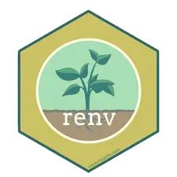

:::
:::

## Overview

::: {.columns}
::: {.column width="40%"}

1. Initialize  
  `renv::init()`

2. Write code, install packages  
  `install.packages()`

3. Record environment  
  `renv::snapshot()`

4. Repeat 2 & 3

5. Restore environment when needed  
  `renv::restore()`

:::
::: {.column width="60%"}

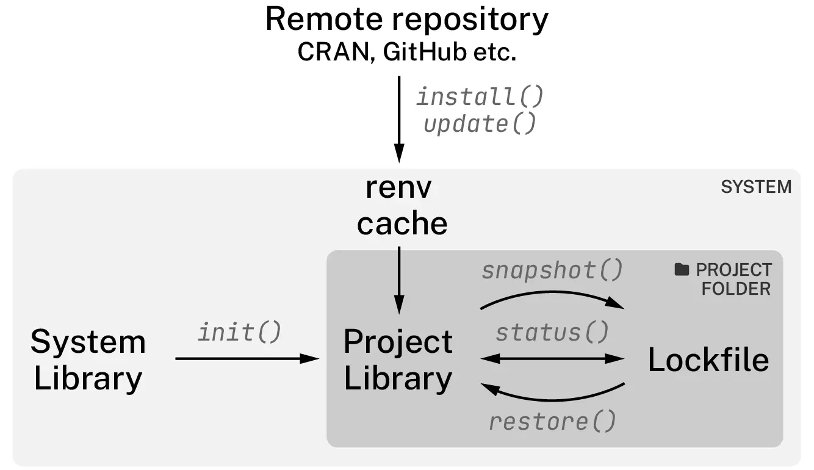

:::
:::

## Initialize

```r
renv::init()
```

Creates in your project:

| File / Folder | Purpose |
|---|---|
| `renv/` | Private package library |
| `renv.lock` | Exact package versions (JSON) |
| `.Rprofile` | Auto-activates `renv` on startup |
| `renv/activate.R` | Bootstrap script |

. . .

::: callout-tip
Commit `renv.lock`, `.Rprofile`, and `renv/activate.R` to Git.  
Add `renv/library/` to `.gitignore`.
:::

## Anatomy of `renv.lock`

```json
{
  "R": {
    "Version": "4.3.2",
    "Repositories": [{ "Name": "CRAN", "URL": "https://p3m.dev/cran/latest" }]
  },
  "Bioconductor": { "Version": "3.18" },
  "remotes": {
    "Package": "remotes",
    "Version": "2.4.2.1",
    "Source": "Repository",
    "Repository": "RSPM",
    "Requirements": [ "R", "methods", "stats", "tools", "utils" ],
    "Hash": "63d15047eb239f95160112bcadc4fcb9"
  }
}
```

- R version & repositories
- Package: name, version, source, repository, requirements, hash

## Check status

What has changed in my project compared to the previous record?

```
> renv::status()
The following package(s) are missing:

 package installed recorded used
 dplyr   n         n        y
 ggplot2 n         n        y
 shiny   n         n        y

See ?renv::status() for advice on resolving these issues.
```

## Snapshot

::: {.panel-tabset}

## Before installing packages

```
> renv::snapshot()
The following required packages are not installed:
- dplyr
- ggplot2
- shiny
Packages must first be installed before renv can snapshot them.
Use `renv::dependencies()` to see where this package is used in your project.

What do you want to do?

1: Snapshot, just using the currently installed packages.
2: Install the packages, then snapshot.
3: Cancel, and resolve the situation on your own.
```

## After installing packages

```
> renv::snapshot()
The following package(s) will be updated in the lockfile:

# RSPM -----------------------------------------------------------------------
- dplyr        [* -> 1.1.4]
- fansi        [* -> 1.0.6]
- generics     [* -> 0.1.3]
- tidyselect   [* -> 1.2.0]
- utf8         [* -> 1.2.4]
- withr        [* -> 3.0.0]

Do you want to proceed? [Y/n]:
```

:::

## Restoring library

::: {.columns}
::: {.column width="50%"}

```
> renv::restore()
The following package(s) will be updated:

# CRAN -----------------------------------------------------------------------
- R6            [* -> 2.5.1]
- fontawesome   [* -> 0.5.2]
- xfun          [* -> 0.41]
- yaml          [* -> 2.3.8]

# RSPM -----------------------------------------------------------------------
- dplyr         [* -> 1.1.4]
- fansi         [* -> 1.0.6]
- withr         [* -> 3.0.0]

Do you want to proceed? [Y/n]:
```

:::
::: {.column width="50%"}

- `renv::restore()`
- Rebuild a project library from a lockfile
- Handles multiple sources
  - CRAN
  - Bioconductor
  - GitHub
  - GitLab
  - Bitbucket
  - Private repositories…

- Will not modify R version

:::
:::

## Tracking lockfile

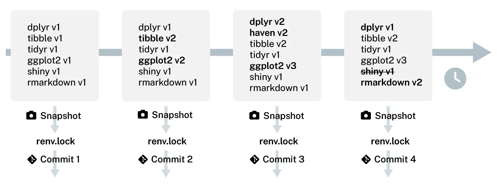

```
# view lockfile history
renv::history()

# revert to previous state
renv::revert(commit="commit 2")
```

## How renv works

::: {.columns}
::: {.column width="33%"}

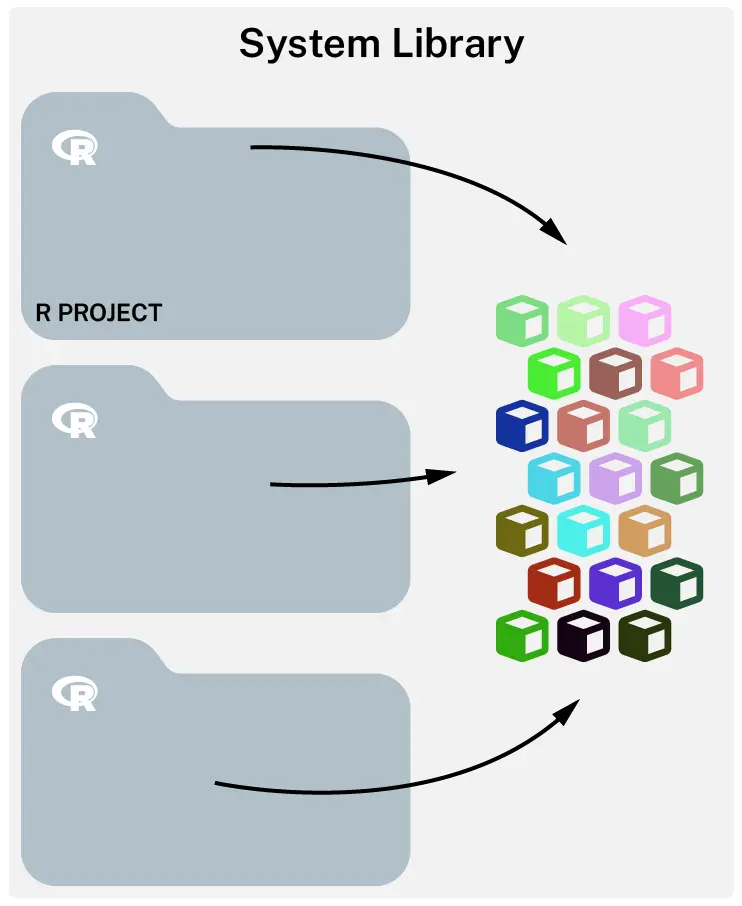

All projects share the same library

:::
::: {.column width="33%" .fragment}

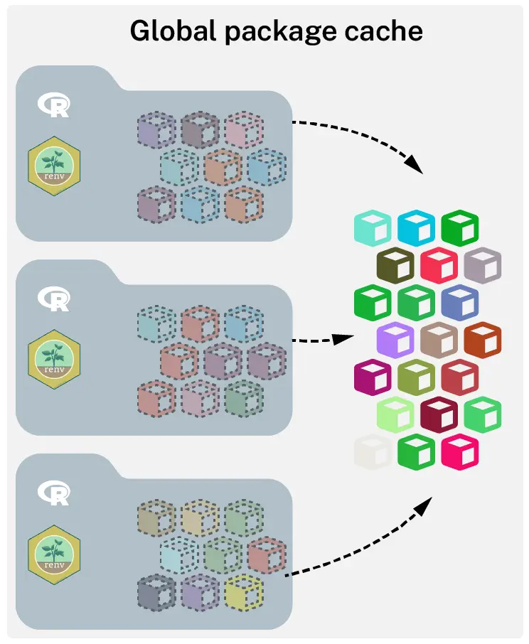

Each project has its own library. Projects' libraries are linked to the global cache.

:::
::: {.column width="33%" .fragment}

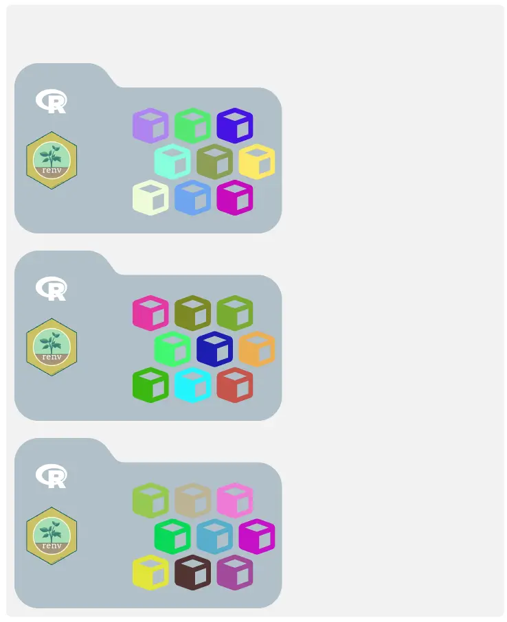

Each project has its own library. Disable global cache: `renv::settings$use.cache(FALSE)`

:::
:::

::: {.notes}

`RENV_PATHS_CACHE`: Set this environment variable to define global package cache. Get the path with `renv::paths$cache()`.  

These are typical locations for the global cache: 

- Linux: 	~/.local/share/env  
- MacOS: 	~/Library/Application Support/renv  
- Windows: 	%LOCALAPPDATA%/renv  

:::

## Tips & Tricks

::: {.incremental}

- Use `renv::dependencies()` to discover dependencies in your project
- Create and maintain a `.renvignore` file to exclude files from dependency discovery
- Snapshot all packages in the library regardless of whether they are used in the project
  `renv::snapshot(type = "all")`
- Ignore a package in the snapshot: `renv::settings$ignored.packages("pkg")`
- Use `renv::install()` to install packages from multiple sources (CRAN, Bioconductor, GitHub, local path)
  `renv::install(c("ggplot2@3.4.0", "bioc::DESeq2", "tidyverse/ggplot2"))`
- Use pak as backend for faster installs: `options(renv.config.pak.enabled = TRUE)`
- Add pkgs to lockfile without installing: `renv::record("pkg")`
- Remove unused packages from the local library: `renv::clean()` or from global cache: `renv::purge()`
- Restore only selected packages: `renv::restore(packages = c("dplyr", "ggplot2"))`
- Copy pkgs from global cache to local library: `renv::isolate()`
- Update a package to a newer version: `renv::update("pkg")`
- If renv is behaving weirdly, try `renv::diagnostics()` to check for common issues
- Disabling renv
  - Temporarily: `renv::deactivate()` or to activate again `renv::activate()`
  - Permanently: `renv::deactivate(clean=TRUE)` removes `renv/`, `.Rprofile` and `renv.lockfile`
  - Remove global cache completely: `unlink(renv::paths$root(), recursive=TRUE)`

:::

## renv is only one piece of the reproducibility puzzle

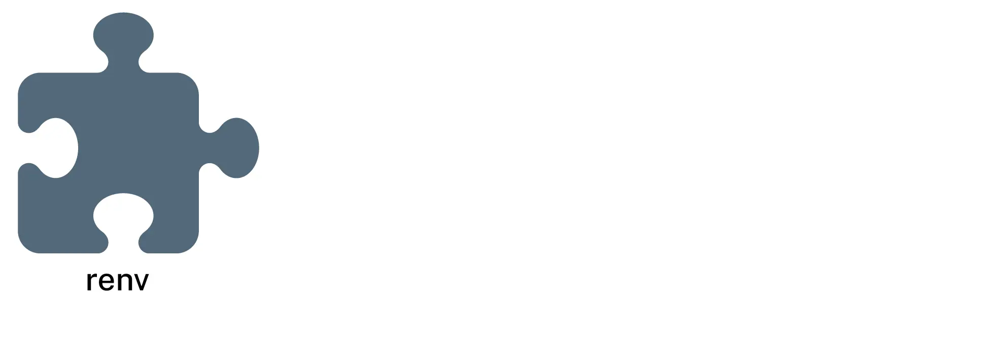{height="95%"}

## renv is only one piece of the reproducibility puzzle

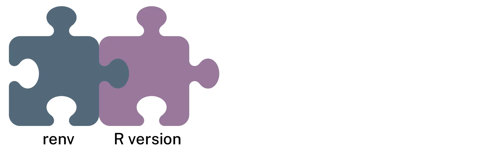{height="95%"}

## renv is only one piece of the reproducibility puzzle

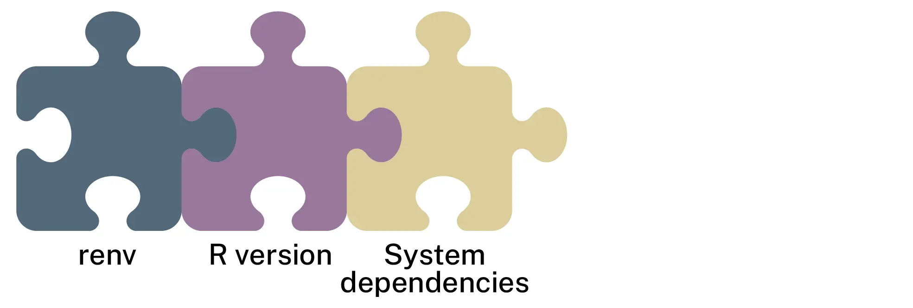{height="95%"}

## renv is only one piece of the reproducibility puzzle

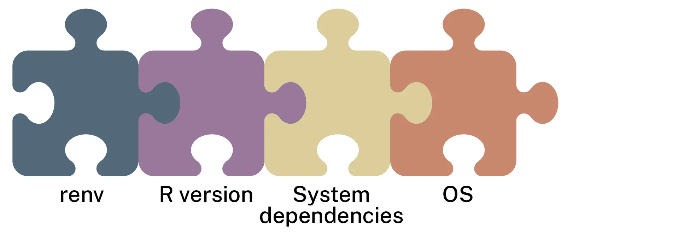{height="95%"}

## renv is only one piece of the reproducibility puzzle

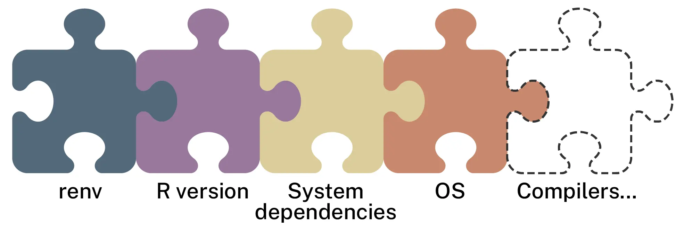{height="95%"}

## Recap

::: {.columns}
::: {.column width="60%"}

**Key commands**

```
renv::init()     # Initialize project lib
renv::snapshot() # Record current lib state
renv::restore()  # Restore lib from lockfile
renv::status()   # Check if lib matches lockfile
```

:::
::: {.column width="40%"}


:::
:::

```
renv::update()       # Update packages
renv::install("pkg") # Install a package
renv::dependencies() # Discover dependencies
renv::history()      # View lockfile history
renv::revert()       # Revert to previous state
renv::clean()        # Remove unused pkgs from local library
renv::purge()        # Remove unused pkgs from global cache
renv::isolate()      # Copy pkgs locally from global cache
renv::diagnostics()  # Check for common issues
renv::deactivate()   # Temporarily disable renv
```

## Alternatives

Emerging alternatives to `renv`


- [**uvr**](https://github.com/nbafrank/uvr)
  - Inspired by Python's `uv` library 
  - uvr.toml manifest and uvr.lock lockfile
  - Manages R version, system dependencies, and R packages
  - Rust-based, fast, and cross-platform
  - Resolves entire environment before installation

. . .

- [**rv**](https://github.com/A2-ai/rv)
  - rproject.yaml manifest and rv.lock lockfile
  - Does not manage R version or system dependencies
  - Rust-based, fast, and cross-platform
  - Resolves entire environment before installation

. . .

- [**ir**](https://r-lib.github.io/ir/)
  - [Posit Blog](https://opensource.posit.co/blog/2026-07-23_ir-0-1-0/)

  > a small command-line tool that runs R scripts and renders Quarto documents using runtime requirements declared in the file itself

## Acknowledgements

::: {.columns}
::: {.column}

  
**Project environments for R**, Kevin Ushey, RStudio::Conf 2020

:::
::: {.column}

  
**Reproducible environments with renv**, Ryan Johnson, NHS-R community 2023

:::
:::

renv official [documentation](https://rstudio.github.io/renv/index.html)

## {background-image="/assets/images/network.svg"}

::: {.v-center .center}
::: {}

[Thank you!]{.largest}

[Questions?]{.larger}

[ • [SciLifeLab](https://www.scilifelab.se/) • [NBIS](https://nbis.se/) • [RaukR](https://nbisweden.github.io/raukr-2026)]{.smaller}

:::
:::

## Session

```{r}
#| echo: false
#| eval: true
sessionInfo()
```
