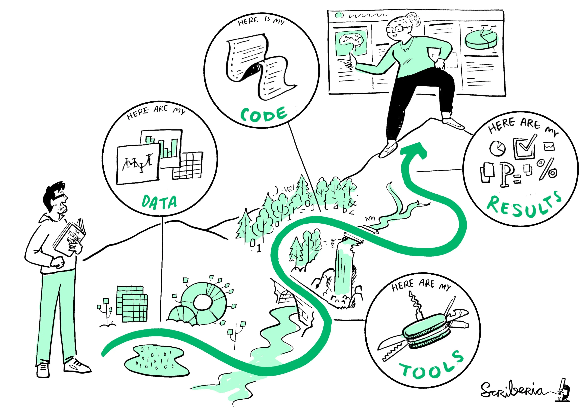
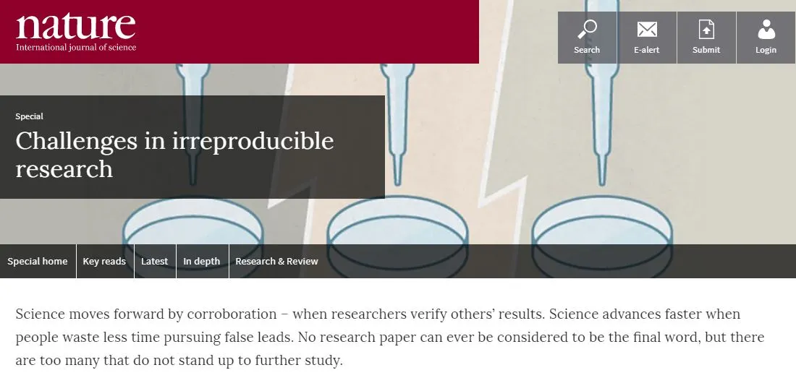
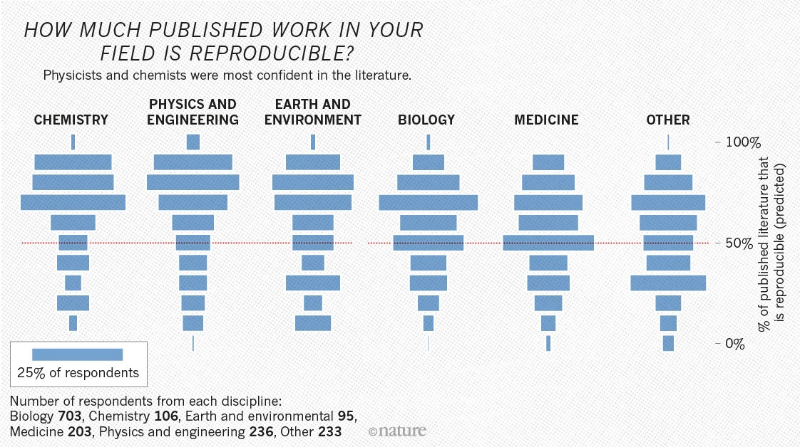
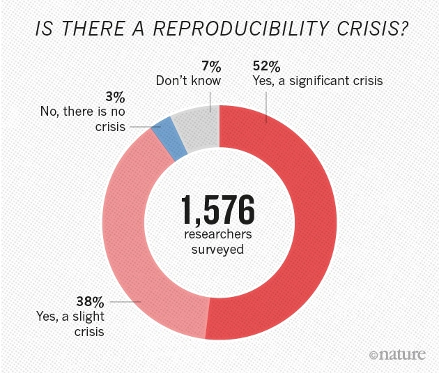
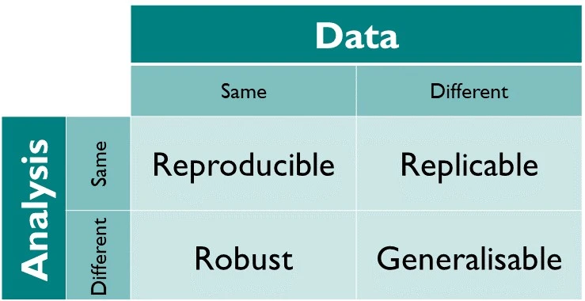
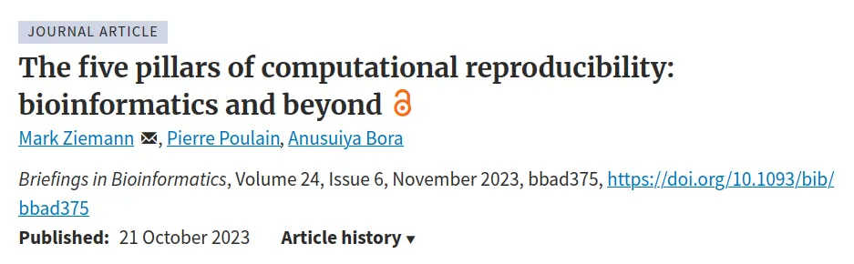
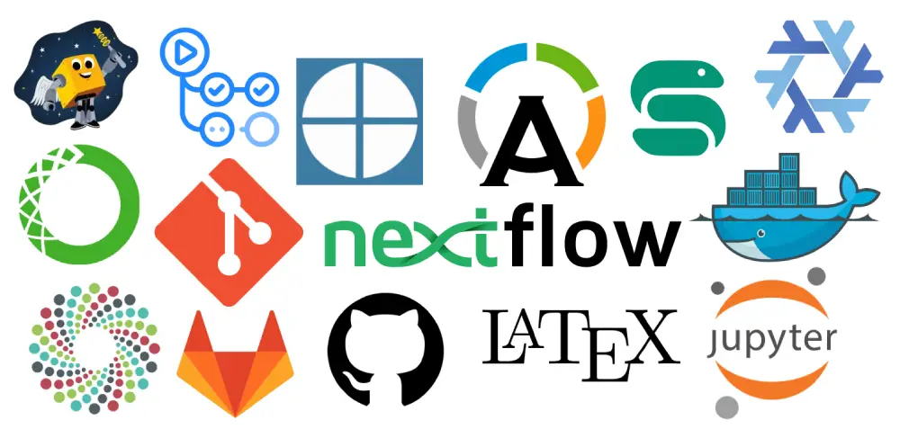
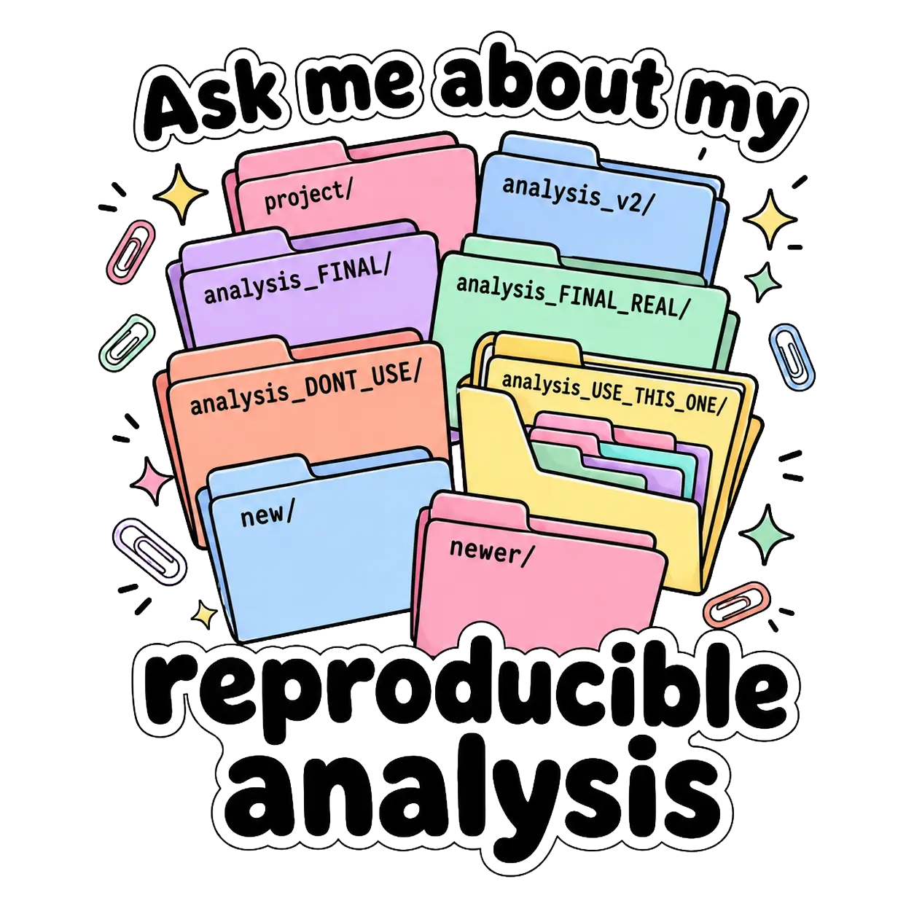

## Contents

{height="400px"}

- Why reproducibility matters in computational research
- Reproducibility steps and guidelines
- Tools and resources for reproducible research in R

::: {.aside}
[The Turing Way](https://book.the-turing-way.org)
:::

## What's all the fuss about?

::: {.aside}

[Challenges in irreproducible research](https://www.nature.com/collections/prbfkwmwvz/)

:::

## Reproducibility crisis?

::: {.columns}
::: {.column width="60%"}

:::
::: {.column width="40%"}

:::

::: {.aside}

[1,500 scientists lift the lid on reproducibility](https://www.nature.com/news/1-500-scientists-lift-the-lid-on-reproducibility-1.19970)

:::
:::

## What is Reproducibility?

{height="400px"}

. . .

> A study is reproducible when someone else (or future you) can obtain the same results using the same data and code.

## Why Does It Matter?

::: {.columns}
::: {.column width="50%"}

**The problem:**

- "Works on my machine" syndrome
- Package versions change silently
- Analysis steps are scattered in scripts
- No clear record of what ran when
- Collaborators cannot reproduce your work

:::
::: {.column width="50%"}

**The cost:**

- Retraction Watch records thousands of retractions
- Irreproducible preclinical research costs billions of dollars per year
- Time wasted re-running broken analyses

:::
:::

## Steps in reproducible research

{height="300px"}

1. Literate programming
2. Code version control and sharing
3. Compute environment control
4. Persistent data sharing (FAIR principles)
5. Documentation

@ziemann2023five @hornung2026overcoming

## The Reproducibility Stack

::: {.columns}
::: {.column width="50%"}

A project needs **several layers** of reproducibility:

- Version control.  
  *Git*
- Share and track code.  
  *GitHub, GitLab, Bitbucket*
- Packages and environment manager.  
  *renv, uvr, rv, Conda, Pixi, Nix, rix*
- Notebooks and documentation.  
  *Jupyter, RMarkdown, Quarto, LaTeX, workflowr*
- Containerized computing environment.  
  *Docker, Apptainer*
- Pipelines and workflow manager.  
  *Snakemake, Nextflow, targets*
- Continuous integration and deployment.  
  *GitHub Actions, Gitlab CI/CD, Jenkins, Travis CI*
- Data storage and sharing.  
  *Zenodo, Dryad, OSF, Dataverse, Figshare*

:::
::: {.column width="50%"}

:::
:::

## Code • Be kind to future you

::: {.incremental}

- Write modular, reusable functions instead of long scripts
- Use informative and consistent naming and style guides (e.g., tidyverse style guide)
- Projects should be self-contained and portable
  - Use project root as the reference point
  - Use relative paths instead of absolute paths for file access
  - Avoid `setwd()` to local paths in code
- Set seed for reproducibility of random processes
- Separate configuration / settings from code
- Use version control (Git) for code and documents
- Host code in a public repository (GitHub, Gitlab, Bitbucket) for backup and collaboration

:::

::: {.fragment}

> Your most demanding collaborator is future **you**, who remembers nothing.

:::

## Environment • Capture the recipe and the kitchen

::: {.incremental}

- Use a package manager (renv, uvr, rv, Conda, Pixi, Nix, rix) to manage dependencies
- Use a workflow manager (targets, Snakemake, Nextflow) to automate analysis pipelines
- Automate analyses instead of relying on manual steps and interactive point-and-click
- Record all analysis parameters and software versions
  - Add session info to reports and notebooks
- Containerize the computing environment (Docker, Apptainer) for reproducibility across systems
- Add clear documentation and README files to explain how to run the analysis

:::

::: {.fragment}

> "Works on my machine" is not a reproducibility strategy.

:::

## Data • Sharing is caring

::: {.incremental}

- Store data in a structured and organized manner
- Prefer open formats (CSV, TSV, Parquet) over proprietary formats (Excel, SPSS, SAS)
- Use a data management plan (DMP) to outline how data will be collected, stored, and shared
- 3-2-1 data backup rule: 3 copies, 2 storage media, 1 off-site
- Separate raw and processed data
- Share data and code in a FAIR manner (with DOI if possible)
- Use a data repository (Zenodo, Dryad, OSF, Dataverse, Figshare) to share data

:::

::: {.fragment}
> "Your downloads folder is not a data repository."
:::

## Further Reading

::: {.columns}
::: {.column width="60%"}

- A Beginner's Guide to Conducting Reproducible Research @alston2021beginner
- Six steps towards reproducible research [Opus Project](https://opusproject.eu/openscience-news/6-steps-towards-reproducible-research/)
- Reproducible Research with R and RStudio @gandrud2020reproducible
- [ORIRIS Project](https://osiris4r.eu/)
- [The Turing Way — Guide for Reproducible Research](https://book.the-turing-way.org)
- Introduction to Data Management Practices [NBIS Workshop](https://nbis.se/training/introduction-to-data-management-practices)
- Reproducible Research: Principles and Practice @martinschweinberger2026reproducible
- Checklists
  - [FAIRER Aware](https://fairerdata.github.io/FAIRER-Aware-REPRODUCIBILITY-Assessment/)
  - International consensus on core reproducibility items in research @banzi2026international

:::
::: {.column width="40%"}

:::
:::

## References

::: {#refs}
:::

## {background-image="/assets/images/network.svg"}

::: {.v-center .center}
::: {}

[Thank you!]{.largest}

[Questions?]{.larger}

[ • [SciLifeLab](https://www.scilifelab.se/) • [NBIS](https://nbis.se/) • [RaukR](https://nbisweden.github.io/raukr-2026)]{.smaller}

:::
:::
