## Contents

- `targets` concepts and architecture
- Visualising and running pipelines
- Working with files and custom functions
- Branching and dynamic targets
- Rendering Quarto documents as targets

## What is targets?

`targets` is a **pipeline toolkit** for R that:

::: {.columns}
::: {.column width="70%"}
::: {.fragment}

- **Declares** steps of your analysis as targets
- Tracks which steps of your analysis are **up to date**
- **Skips** steps whose inputs have not changed
- Makes the **dependency graph** of your analysis explicit
- Provides **reproducibility by design**

:::
::: {.fragment}

**The problem targets solves**

- You have a 3-hour data processing step
- You change a plotting function
- Do you need to re-run data processing? **No — but how do you know?**
- With a flat script, you re-run everything
- With targets, only the **changed** and **downstream** steps re-run

:::
:::
::: {.column width="30%"}


:::
:::

## targets architecture

```
_targets.R   ← pipeline definition (the only required file)
_targets/    ← cache directory (auto-created)
  objects/   ← serialised target outputs
  meta/      ← dependency graph metadata
  user/      ← user-defined metadata
R/           ← your functions (recommended)
```

. . .

::: callout-important
The `_targets.R` file **must** be at the project root. It defines all targets using `tar_target()` inside a `list()`.
:::

## Minimal example

::: {.columns}
::: {.column width="50%"}

**Normal code**

```r
data_raw <- datasets::mtcars
data_clean <- transform(data_raw, 
  am = factor(
    am, 
    labels = c(
      "automatic", 
      "manual"
    )
  )
)
model <- stats::lm(mpg ~ wt + am,
  data = data_clean
)
model_summary <- summary(model)
```

:::
::: {.column width="50%" .fragment}

**targets pipeline**

```r
library(targets)

list(
  tar_target(data_raw, datasets::mtcars),
  tar_target(
    data_clean,
    transform(data_raw, 
      am = factor(am, labels = c("automatic", "manual"))
    )
  ),
  tar_target(model, stats::lm(mpg ~ wt + am, 
    data = data_clean)
  ),
  tar_target(model_summary, summary(model))
)
```

This defines a pipeline:

```
data_raw → data_clean → model → model_summary
```

:::
:::

## target anatomy

```r
tar_target(
  name    = my_target,               # target name (symbol, not string)
  command = my_function(x),          # R expression to run
  format  = "rds",                   # how to store (rds, qs, feather, ...)
  pattern = NULL,                    # dynamic branching (later)
  cue     = tar_cue(mode = "always") # optional invalidation rule
)
```

## Exploring the pipeline

::: {.columns}
::: {.column width="50%"}

- `tar_manifest()` Structure & dependencies

```
# A tibble: 4 × 2
  name          command                                                         
  <chr>         <chr>                                                           
1 data_raw      "datasets::mtcars"                                              
2 data_clean    "transform(data_raw, am = factor(am, labels = c(\"automatic\", …
3 model         "stats::lm(mpg ~ wt + am, data = data_clean)"                   
4 model_summary "summary(model)"  
```

::: {.fragment}

- `tar_outdated()` targets status

```
[1] "data_clean"    "model_summary" "data_raw"      "model"  
```

:::

::: {.fragment}

- `tar_meta()` Metadata about targets, status, and dependencies

:::

:::
::: {.column width="50%"}
::: {.fragment}

- `tar_visnetwork()` Visualize dependency graph

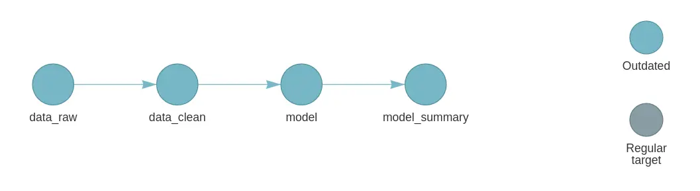

Opens an interactive graph in the viewer:

| Colour | Meaning |
|---|---|
| Grey | Outdated: will run |
| Green | Up to date: will be skipped |
| Blue | Functions / objects |
| Red | Error |

:::
::: {.fragment}

- `tar_glimpse()` Visualize simpler dependency graph

:::
:::
:::

::: {.notes}

Save graph to HTML for sharing:

```
vis <- tar_visnetwork()
htmlwidgets::saveWidget(vis, "~/network.html", selfcontained = TRUE)
browseURL(normalizePath("~/network.html"))
```

:::

## Running the pipeline

::: {.columns}
::: {.column width="50%"}

Run specific targets

`tar_make(names = "data_clean")`

```
+ data_raw dispatched                       
✔ data_raw completed [0ms, 1.23 kB]
+ data_clean dispatched
✔ data_clean completed [0ms, 1.26 kB]
✔ ended pipeline [209ms, 2 completed, 0 skipped]
```

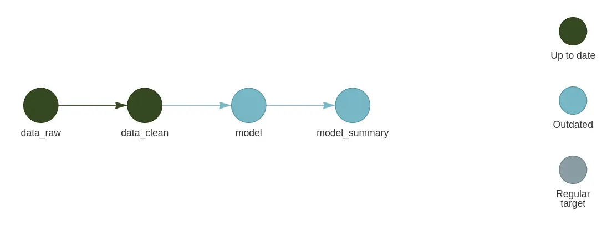

:::
::: {.column width="50%" .fragment}

Run all targets

`tar_make()`

```
+ model dispatched                          
✔ model completed [3ms, 3.42 kB]
+ model_summary dispatched
✔ model_summary completed [1ms, 2.33 kB]
✔ ended pipeline [193ms, 2 completed, 2 skipped]
```

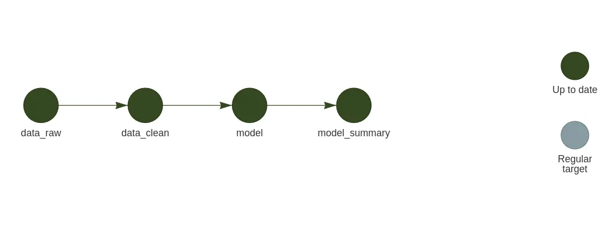

:::
:::

::: {.notes}

```r
# Run with parallel workers using crew
tar_option_set(controller = crew::crew_controller_local(workers = 2))
tar_make()
```

:::

## Reading target outputs

```r
# Load a target into the R session
tar_load(model)

# Load multiple targets
tar_load(c(data_clean, model, model_summary))

# Read without loading into session
tar_read(model)

# Load all targets matching a pattern
tar_load(starts_with("data_"))
```

## Dependency tracking

**targets** tracks **three types of dependencies**:

| Type | What changes trigger re-run |
|---|---|
| **Data** | The target's upstream data changed |
| **Command** | The R expression in `command` changed |
| **Functions** | Any function called in `command` changed |

. . .

::: callout-tip
**targets** hashes the body of every function. Change a function body → downstream targets are automatically invalidated.
:::

## Simplifying the pipeline

::: {.columns}
::: {.column width="50%"}

Normal pipeline

```r
library(targets)

list(
  tar_target(data_mtcars, datasets::mtcars),
  tar_target(plot_mtcars, {
    ggplot2::ggplot(data_mtcars,
    ggplot2::aes(wt, mpg, colour = factor(cyl))) +
      ggplot2::geom_point(size = 3) +
      ggplot2::labs(colour = "Cylinders")
  })
)
```

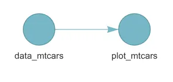{height="150px"}

:::
::: {.column width="50%" .fragment}

Place custom functions in `R/` 

```r
fn_plot_scatter <- function(dfr) {
  ggplot2::ggplot(dfr, ggplot2::aes(wt, mpg, colour = factor(cyl))) +
    ggplot2::geom_point(size = 3) +
    ggplot2::labs(colour = "Cylinders")
}
```

And source them at the top of `_targets.R`:


```r
library(targets)
source("R/functions.R")
list(
  tar_target(data_mtcars, datasets::mtcars),
  tar_target(plot_mtcars, fn_plot_scatter(data_mtcars))
)
```

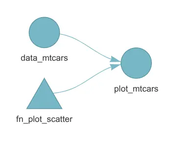{height="150px"}

:::
:::

## Storage formats

```r
tar_target(big_data, load_data(), format = "feather")  # fast columnar
tar_target(model,    fit(),       format = "qs")       # fast serialization
tar_target(plot,     make_plot(), format = "file")     # external file
tar_target(report,   render(),    format = "file")     # Quarto / Rmd output
```

. . .

| Format | Use case |
|---|---|
| `"rds"` | Default, any R object |
| `"qs"` | Faster than rds, any R object |
| `"feather"` | Large data frames |
| `"file"` | File path returned by command |

## Working with files

::: {.columns}
::: {.column width="50%"}

Normal pipeline

```r
library(targets)
source("R/functions.R")
list(
  tar_target(data_mtcars, datasets::mtcars),
  tar_target(plot_mtcars, fn_plot_scatter(data_mtcars)),
  tar_target(file_mtcars, {
    out <- "plot-mtcars.png"
    ggplot2::ggsave(out, plot_mtcars, width = 7, height = 5)
    out
  }, format = "file")
)
```

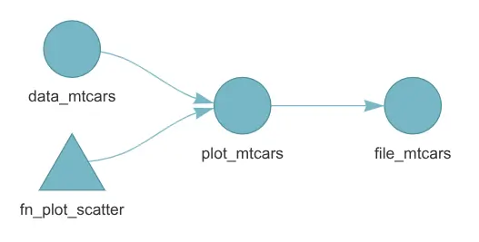{height="150px"}

:::
::: {.column width="50%"}

Create a function to save the plot and return the file path:

```r
fn_plot_save <- function(plot, filename) {
  ggplot2::ggsave(filename, plot, width = 7, height = 5)
  filename
}
```

```r
library(targets)
source("R/functions.R")
list(
  tar_target(data_mtcars, datasets::mtcars),
  tar_target(plot_mtcars, fn_plot_scatter(data_mtcars)),
  tar_target(file_mtcars, fn_plot_save(plot_mtcars, "mtcars-plot.png"), format = "file")
)
```

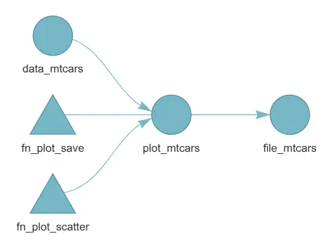{height="150px"}

:::
:::

## Extending targets with tarchetypes

`tarchetypes` provides **high-level target archetypes** that reduce boilerplate in `targets` pipelines.

```r
install.packages("tarchetypes")
library(tarchetypes)
```

::: {.columns .fragment}
::: {.column width="70%"}

A collection of **factory functions** that create common target patterns — especially for:

- Rendering Quarto / R Markdown documents
- Iterating over combinations of parameters
- Time-based cues and polling
- Grouping dynamic branches

:::
::: {.column width="30%"}


:::
:::

## Branching

Split one target into independent pieces of work when each piece can run and cache separately.

| Type | Use when | Main tool |
|---|---|---|
| **Static** (`tarchetypes`) | The number of tasks is known before the pipeline runs | `tar_map()` |
| **Dynamic** | The number of tasks is unknown until the pipeline runs | `pattern = map()` |
| **Grouped dynamic** (`tarchetypes`) | Each data.frame group needs the same work | `tar_group_by()` + `map()` |


. . .

::: {.columns}
::: {.column width="50%"}

**Dynamic: input decides the branches**

```r
tar_target(result, fn(input), pattern = map(input))
```

New values in `input` create new branches on the next `tar_make()`.

:::
::: {.column width="50%"}

**Static: code decides the branches**

```r
tar_map(values = parameters,
  tar_target(result, fn(value))
)
```

The target names and count are fixed when the pipeline is loaded.

:::
:::

## Static branching

When you know every case before the pipeline runs.

::: {.columns}
::: {.column width="70%"}

```r
library(targets)
library(tarchetypes)

species_names <- c(
  "setosa",
  "versicolor",
  "virginica"
)

list(
  tar_target(data, datasets::iris),
  tar_map(
    values = list(
      species_name = species_names
    ),
    names = species_name,
    tar_target(
      data_summary,
      dplyr::summarise(
        dplyr::filter(data, Species == species_name),
        species = dplyr::first(Species),
        observations = dplyr::n(),
        mean_sepal_length = mean(Sepal.Length)
      )
    )
  )
)
```

:::
::: {.column width="30%"}

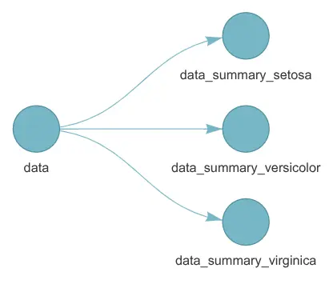

:::
:::

::: {.aside}

[Static branching](https://docs.ropensci.org/tarchetypes/reference/tar_map.html)

:::

## Dynamic branching

When the number of cases is unknown until the pipeline runs.

::: {.columns}
::: {.column width="70%"}

```r
library(targets)

list(
  tar_target(data, datasets::iris),
  tar_target(
    species_names,
    as.list(sort(unique(data$Species))),
    iteration = "list"
  ),
  tar_target(
    data_summary,
    dplyr::summarise(
      dplyr::filter(data, Species == species_names),
      species = dplyr::first(Species),
      observations = dplyr::n(),
      mean_sepal_length = mean(Sepal.Length)
    ),
    pattern = map(species_names),
    iteration = "list"
  ),
  tar_target(
    data_summary_combined,
    dplyr::bind_rows(data_summary)
  )
)
```

:::
::: {.column width="30%"}

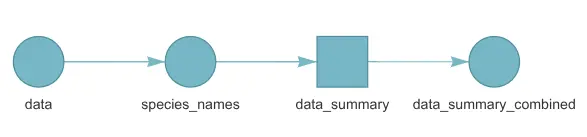

:::
:::

::: {.aside}

[Dynamic branching](https://books.ropensci.org/targets/dynamic-branching.html)

:::

## Branching with groups

Split a data frame into groups and process each group as a branch:

::: {.columns}
::: {.column width="70%"}

```r
library(targets)
library(tarchetypes)

list(
  tar_group_by(
    split_data,
    datasets::iris,
    Species
  ),
  tar_target(
    data_summary,
    dplyr::summarise(
      split_data,
      species = dplyr::first(Species),
      observations = dplyr::n(),
      mean_sepal_length = mean(Sepal.Length)
    ),
    pattern = map(split_data),
    iteration = "list"
  ),
  tar_target(
    data_summary_combined,
    dplyr::bind_rows(data_summary)
  )
)
```

:::
::: {.column width="30%"}

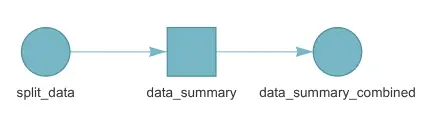

:::
:::

::: {.aside}

[Branching with groups](https://docs.ropensci.org/tarchetypes/reference/tar_group_by.html)

:::

## Render quarto documents

```r
list(
  tar_target(data, load_data()),
  tar_target(model, fit(data)),

  tar_quarto(
    report,
    path = "report.qmd",
    quiet = FALSE
  )
)
```

. . .

`tar_quarto()`:

- Tracks the source document and dependencies referenced with `tar_read()` / `tar_load()`
- Use `extra_files` for additional files that Quarto does not discover automatically
- Tracks the output HTML / PDF as a `format = "file"` target

::: {.notes}

`tar_render()` is similar, but for R Markdown documents.

:::

## More tarchetypes

- `tar_map()`: Static Branching - Create **named sets of targets** from a grid of values:
- `tar_combine()`: Aggregating results from branches
- `tar_age()`: Time-Based cues - Re-run a target if it is **older than a threshold**:

## Configuration

```r
# At top of _targets.R
tar_option_set(
  packages   = c("tidyverse", "here"),  # loaded in every target
  format     = "qs",                    # default storage format
  error      = "continue",              # keep going on errors
  memory     = "transient",             # free memory after each target
  workspace_on_error = TRUE             # save workspace for debugging
)
```

. . .

::: callout-tip
Use `tar_option_set(packages = ...)` instead of `library()` calls inside each target's command.
:::

## Debugging

```r
# Load the target's workspace to debug interactively
tar_workspace(failed_target)

# Run target in main R session (no parallelism)
tar_make(callr_function = NULL)

# See what `targets` knows about a target
tar_meta(failed_target, fields = everything())
```

. . .

`workspace_on_error = TRUE` in `tar_option_set()` automatically saves the workspace when a target errors.

::: {.aside}
[Debugging documentation](https://books.ropensci.org/targets/debugging.html)
:::

## A complete pipeline

::: {.columns}
::: {.column width="60%"}

```r
library(targets)
library(tarchetypes)
library(crew)

fn_clean <- function(data) {
  dplyr::filter(data, 
    !is.na(flipper_length_mm), !is.na(body_mass_g)
  )
}

fn_summarize <- function(data) {
  dplyr::summarise(
    data,
    penguins = dplyr::n(),
    mean_flipper_mm = mean(flipper_length_mm),
    mean_body_mass_g = mean(body_mass_g)
  )
}

fn_plot <- function(data) {
  path <- "output/penguin-flipper-mass.png"
  dir.create(dirname(path), showWarnings = FALSE)
  plot <- ggplot2::ggplot(
    data,
    ggplot2::aes(
      flipper_length_mm, 
      body_mass_g, 
      colour = species
    )
  ) +
    ggplot2::geom_point() +
    ggplot2::labs(
      x = "Flipper length (mm)", 
      y = "Body mass (g)"
    )
  ggplot2::ggsave(
    path, plot, width = 7, height = 5
  )
  path
}

tar_option_set(
  packages = c("dplyr", "ggplot2", "palmerpenguins"),
  format = "rds",
  seed = 42,
  controller = crew::crew_controller_local(workers = 2)
)

list(
  tar_target(data_raw, palmerpenguins::penguins),
  tar_target(data_clean, fn_clean(data_raw)),

  # Run one summary branch for each species.
  tar_group_by(data_grouped, data_clean, species),
  tar_target(
    species_summary,
    fn_summarize(data_grouped),
    pattern = map(data_grouped),
    iteration = "list"
  ),
  tar_target(
    data_combined, 
    dplyr::bind_rows(species_summary)
  ),

  tar_target(
    plot_file,
    fn_plot(data_clean),
    format = "file"
  )
)
```

:::
::: {.column width="40%"}

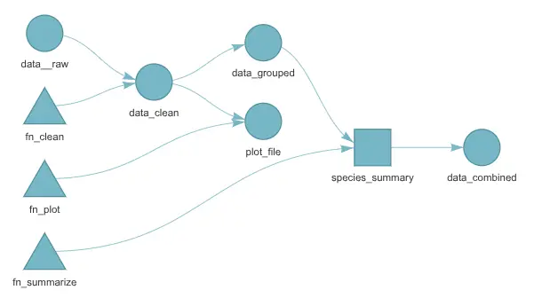

:::
:::

## Tips & tricks

- Targets should only depend on other targets, not on objects or functions in the global environment
- Break large tasks into smaller targets for better caching and parallelism
- Use descriptive target names that reflect the output, not the function name. Eg: data_clean, model_summary etc
- Use reusable functions in `R/` to declutter the pipeline
- Use `tar_option_set(packages = ...)` instead of `library()` calls inside each target
- Set seed for reproducible random results: `tar_option_set(seed = 42)`
- Use formats like qs, fst, arrow, or parquet when appropriate for fast read/write
- Add `_targets/` to `.gitignore`
- Use `tar_visnetwork(targets_only = TRUE)` to hide functions and reduce clutter
- Use `tar_read()` only for interactive exploration; avoid in pipeline commands

## Tips & tricks

- Use `tar_make(callr_function = NULL)` to run the pipeline in the main R session for troubleshooting
- Get error messages for targets that failed using `tar_meta(fields = error, complete_only = TRUE)`
- Use `crew` package for parallel execution of targets
- Use `tar_cue(mode = "always")` for targets that should always re-run or `tar_age()` for time-based re-runs
- Quarto document can be rendered as a target with `tar_quarto()` or `tar_render()`. R code in a quarto document can be treated as a pipeline target using `tar_tangle()`
- You can have multiple pipelines in the same directory by having separate targets scripts and cache (store) directories.  
- Use package management tools like renv to freeze package versions alongside your targets workflow

## More information

- [**targets** user manual](https://books.ropensci.org/targets/)
- [`tarchetypes` reference](https://docs.ropensci.org/tarchetypes/)
- Using targets by Daniel Navarro [Blog](https://blog.djnavarro.net/posts/2025-01-08_using-targets/)
- Using targets by Will Landau [YouTube](https://youtu.be/Iv6IZwYacXg?si=OKH9Ze8vJd2Dwv_2)
- Manage your analyses with targets by Irena Papst [YouTube](https://youtu.be/OCFAYFeOQ7w?si=yG0SbrEzGRjGOdtM)

## {background-image="/assets/images/network.svg"}

::: {.v-center .center}
::: {}

[Thank you!]{.largest}

[Questions?]{.larger}

[ • [SciLifeLab](https://www.scilifelab.se/) • [NBIS](https://nbis.se/) • [RaukR](https://nbisweden.github.io/raukr-2026)]{.smaller}

:::
:::
