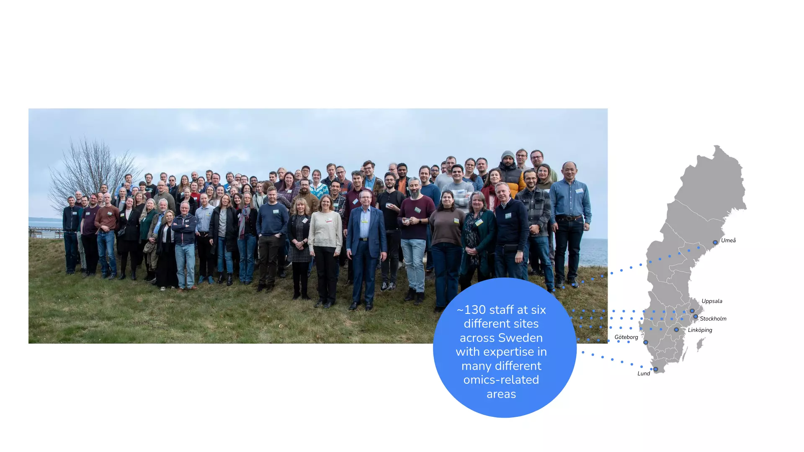
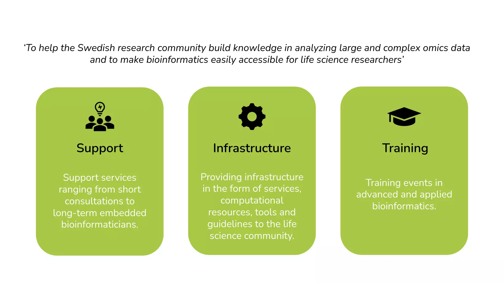
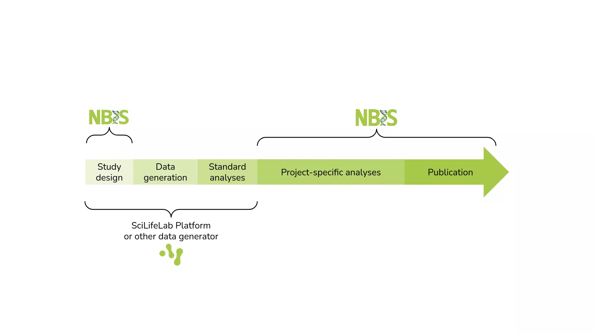
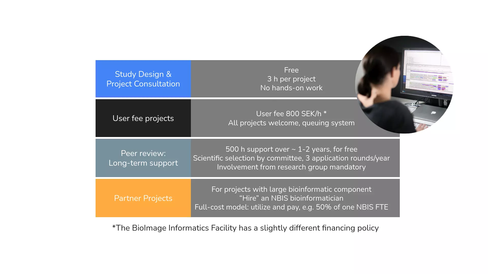
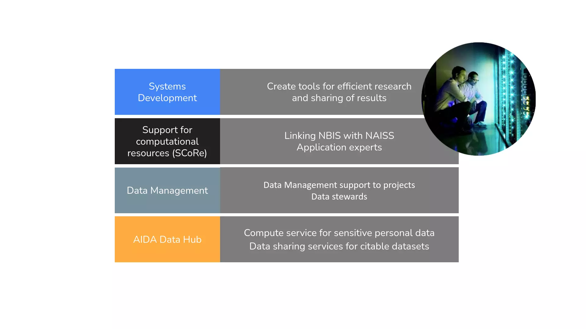
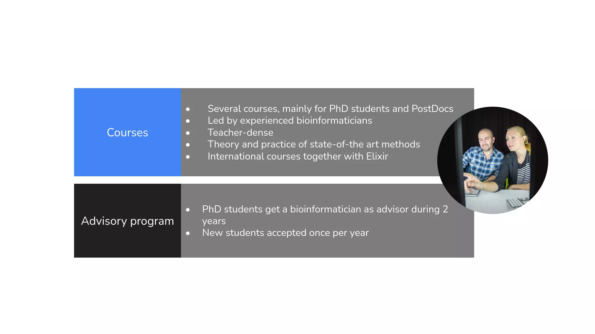
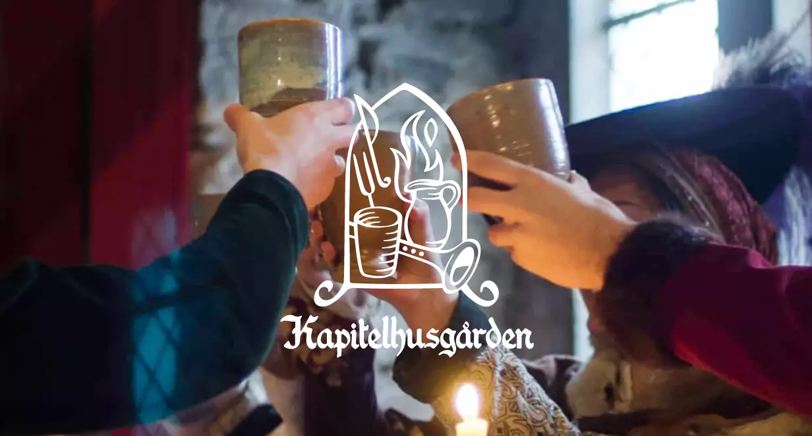
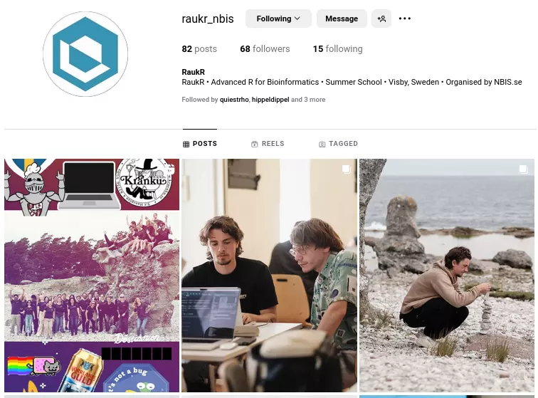

## NBIS: SciLifeLab Bioinformatics Platform

##

##

## Support options

## Infrastructure

## Training

## Upcoming workshops

::: {.large}

- Introduction to Data Management Practices, 09-11 Sep 2025, Lund
- Population genomics in practice, 15-19 Sep 2025, Uppsala
- Epigenomics Data Analysis: from Bulk to Single Cell, 22-26 Sep 2025, Online
- <https://nbis.se/training>
- <https://training.scilifelab.se/events>

:::

## {background-image="assets/elixir.webp"}

## Venue {background-image="assets/campus.webp"}  

::: {.incremental}
- Entrances/Exits
- Classrooms
- Alternate classrooms
- Restaurant
- Fire exit
- Toilets
:::

## Social activities {background-image="assets/michael-odelberth-uQR7YByRHWk-unsplash-1.webp"}

::: {.fragment}

#### Walking tour

- 10th June (Tue) at 17:30
- Campus Gotland

:::
::: {.fragment}

#### BBQ

- Typically organized by students
- Depends on the weather
- If you plan one, let us know date & time :)

:::

## Course Dinner

  

[S:t Drottensgatan 8, 621 56 Visby](https://maps.app.goo.gl/RbvFqZktmTKJtuc48)  
15th August (Sat) at 18:00  

## Excursion {background-image="assets/casper-van-battum-3eOMkWeWVUc-unsplash.webp"}  

::: {style="background-color:#f8f9f9;padding:10px;border-radius:8px;opacity:0.85;"}
- Bus trip to När & Ljugarn
- 16th August (Sun) from 09:15 - 18:00
- Leaving from Fenomenalen ([Skeppsbron 4, 621 57 Visby](https://maps.app.goo.gl/uBYS5n8eHVDsjQdJA))  
- Back to Visby at 18:00  
:::

## Instagram

Instagram: [**raukr_nbis**]{.badge}  
 If you do not want to be photographed, let us know.  

## Note

::: {.incremental}
- Doors lock during lunch time and after 17:00
- Saturday is optional (Doors will be locked)
- Use Slack for communication
- If you cannot attend a session, let us know
- If you are feeling sick, let us know
- Certificates will be emailed to you on satisfactory completion of the workshop
:::

## Zoom lecture

::: {.large}
**Introduction to Quarto** by Christophe Dervieux  
Classroom B24?  
10th June (Tue) at 09:00  
:::

## Technical

- Power
- Wifi
- System setup

##  {background-image="assets/casper-van-battum-ZTGGdBgeCeE-unsplash.webp"}

::: {.v-center .center}
::: {style="background-color:#f8f9f9;padding:10px;border-radius:8px;opacity:0.75;"}

[Questions?]{.largest}

::: {.smaller}

**Image credits**

Unsplash | Casper Van Battum  
Unsplash | Michael Odelberth  

:::

[ • [SciLifeLab](https://www.scilifelab.se/) • [NBIS](https://nbis.se/) • [RaukR](https://nbisweden.github.io/raukr-2026)]{.smaller}

:::
:::
